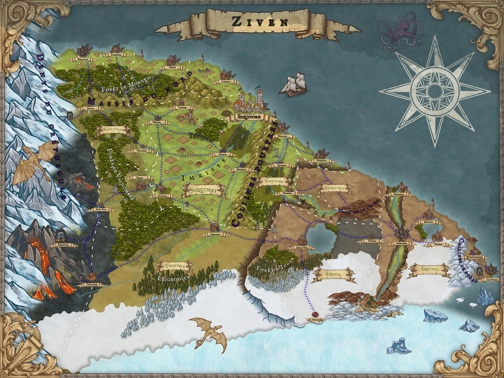

# 🌍 Ziven — Monde de jeu de rôle

Ziven est un sous-continent imaginaire conçu pour le jeu de rôle **Donjons & Dragons**.  
C’est un monde hostile et contrasté, marqué par ses frontières naturelles, ses peuples divers et ses luttes de pouvoir.

## Dimensions et frontières

- **Sous-continent** : 2000 km (N–S) × 3500 km (E–O).
- **Nord** : **Océan Gidhun** relativement calme, permettant le commerce avec le reste du monde.  
  Un **kraken** rôde près des Dents du Crépuscule, forçant les navigateurs à de longs détours.
- **Ouest** : Les **Dents du Crépuscule**, montagnes infranchissables où vivent des dragons blancs adultes.  
  Villages miniers humains et drakkéïdes subsistent malgré leurs raids.
- **Sud** : La **Mer de Narvë**, banquises mouvantes et créatures carnivores.  
  De jeunes dragons blancs y grandissent avant de migrer vers les montagnes.
- **Est** : L’**Océan Gidhun** (aussi appelé **Gidhunpoorv**) aux vents violents.  
  Au sud-est, le **cap Poorv**, avec son immense fort militaire et ses mines de charbon exploitées par des bagnards.

## Répartition des peuples

- **Humains** : majoritaires, présents partout (plaine, ports, villages, ouest frontalier).
- **Drakkéïdes** : villages proches des nains, dans les Dents du Crépuscule.  
  Respectés pour leur résistance face aux dragons.
- **Nains** : maîtres des mines et du commerce de métaux, installés dans les montagnes.
- **Dragons blancs** : prédateurs majeurs, adultes dans les montagnes, jeunes dans la banquise.
- **Elfes (non endémiques)** : riches marchands et érudits, surtout dans les ports.  
  Exclus de la noblesse, mais influents.
- **Tieffelins (non endémiques)** : concentrés dans les ports du nord, mais pauvres et rejetés.

## 📖 Documentation

La documentation complète est disponible dans le dossier [`docs/`](./docs).

### Royaumes
- [Khazal](./docs/royaumes/khazal.md) — royaume des steppes, organisé autour du lac Dorin et menacé par les dragons du sud.  
- [Edravorn](./docs/royaumes/edravorn.md) — vaste territoire tribal, sans roi, où les tribus répondent à l’appel en cas de menace.  
- [Valcalme](./docs/royaumes/valcalme.md) — royaume prospère du nord, qui contrôle l’embouchure de l’Aldéra et le commerce maritime.  
- [Siquimes](./docs/royaumes/siquimes.md) — dynastie marchande, puissante autour de l’estuaire de l’Imrisse.  

### Régions
- [Plaine centrale](./docs/regions/plaine_centrale.md) — territoire fertile, densément peuplé, traversé par l’Imrisse.  
- [Onalpita](./docs/regions/onalpita.md) — grand plateau balayé par les vents, au sud-est du continent.  
- [Dents du Crépuscule](./docs/regions/dents_du_crepuscule.md) — chaîne de montagnes peuplée de dragons blancs adultes.  
- [Cap Poorv et Collines](./docs/regions/cap_poorv_et_collines.md) — forteresse colossale et mines de charbon exploitées par des bagnards.  
- [Steppes de Khazal](./docs/regions/steppes_de_khazal.md) — vaste steppe froide, organisée autour du lac Dorin.  
- [Collines de l’Écho](./docs/regions/collines_de_lecho.md) — terres rocheuses où les voix résonnent, refuge de pillards et de gobelins.  
- [Mer de Narvë](./docs/regions/mer_de_narve.md) — banquises mouvantes et créatures carnivores.  

### Fleuves
- [Imrisse](./docs/fleuves/imrisse.md) — prend sa source dans les Dents du Crépuscule et traverse la plaine centrale. Navigable jusqu’à Glounar.  
- [Imgodir](./docs/fleuves/imgodir.md) — coupe Onalpita sur plus de 1000 km en un canyon profond de 1000 m.  
- [Aldéra](./docs/fleuves/aldera.md) — né sur le plateau d’Onalpita, franchit le Voile d’Aldéra avant de rejoindre Valcalme.  

### Villes
- [Siquivorn](./docs/villes/siquivorn.md) — capitale du royaume de Siquimes, ville de canaux dominée par le palais Siquimes.  
- [Glounar](./docs/villes/glounar.md) — deuxième ville du sous-continent, carrefour commercial sur l’Imrisse.  
- [Poorvichahar](./docs/villes/poorvichahar.md) — port du sud-est, centre d’exportation du charbon.  
- [Dibornad](./docs/villes/dibornad.md) — ville installée dans le delta de l’Imgodir.  

### Factions
- [Famille Siquimes](./docs/factions/famille_siquimes.md) — dynastie régnante, influente dans le commerce fluvial et maritime.  
- [Garnison du Fort de Poorv](./docs/factions/garnison_fort_poorv.md) — garnison mixte, composée de toutes les races, gardienne du sud-est.  
- [Marchands elfes d’Iglindon](./docs/factions/marchands_elfes_iglindon.md) — réseau de commerçants et érudits établis dans les ports.  
- [Communautés tieffelines des ports du nord](./docs/factions/communautes_tieffelines_ports_nord.md) — marginaux, organisés en petites confréries de survie.  
- [Nains des Dents du Crépuscule](./docs/factions/nains_dents_du_crepuscule.md) — clans miniers puissants, alliés traditionnels des drakkéïdes.  
- [Villages drakkéïdes de l’Ouest](./docs/factions/villages_drakkeides_ouest.md) — hameaux fortifiés, connus pour leur courage face aux dragons.  

