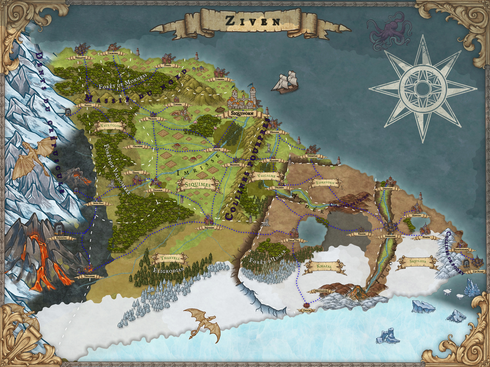

# 🌍 Ziven — Monde de jeu de rôle

Ziven est un sous-continent imaginaire conçu pour le jeu de rôle **Donjons & Dragons**.  
C’est un monde hostile et contrasté, marqué par ses frontières naturelles, ses peuples divers et ses luttes de pouvoir.

## 1. Dimensions et frontières

- **Sous-continent** : 2000 km (N–S) × 3500 km (E–O).
- **Nord** : **Océan Gidhun** relativement calme, permettant le commerce avec le reste du monde.  
  Un **kraken** rôde près des Dents du Crépuscule, forçant les navigateurs à de longs détours.
- **Ouest** : Les **Dents du Crépuscule**, montagnes infranchissables où vivent des dragons blancs adultes.  
  Villages miniers humains et drakkéïdes subsistent malgré leurs raids.
- **Sud** : La **Mer de Narvë**, banquises mouvantes et créatures carnivores.  
  De jeunes dragons blancs y grandissent avant de migrer vers les montagnes.
- **Est** : L’**Océan Gidhun** (aussi appelé **Gidhunpoorv**) aux vents violents.  
  Au sud-est, le **cap Poorv**, avec son immense fort militaire et ses mines de charbon exploitées par des bagnards.

## 2. Régions et lieux majeurs

- **Cap Poorv** : Forteresse colossale tenant la jonction entre l’océan du nord et la Mer de Narvë.  
  Garnison mixte (toutes races) et bagne minier pour l’exploitation du charbon.  
  Les collines de Poorv sont la frontière orientale du grand plateau central.
- **Plaine centrale** : vaste territoire fertile, densément peuplé, traversé par le fleuve **Imrisse**.
- **Onalpita** : Grand plateau qui s’étend sur une grande partie du sud-est du pays.  
  Territoire hostile et balayé par les vents du sud, entre la plaine centrale et les collines de Poorv.  
  Au nord de ce plateau se trouvent les **steppes de Khazal** et les **collines de l’écho**.
- **Fleuve Imrisse** : prend sa source dans les Dents du Crépuscule, traverse la plaine jusqu’à l’estuaire.  
  Navigable jusqu’à **Glounar**.
- **Fleuve Imgodir** : coupe Onalpita sur un peu plus de 1000 km.

## 3. Villes

- **Siquivorn** : capitale du royaume de Siquimes, au fond de l’estuaire de l’Imrisse (15 km de long).  
  Ville parcourue de canaux, dominée par la colline du **palais Siquimes**.
  - **Iglindon** : quartier elfique au nord-ouest de l’estuaire, fermé aux étrangers.
- **Glounar** : deuxième ville du sous-continent, carrefour commercial où cesse la navigabilité du fleuve.  
  Limite du contrôle direct de la famille **Siquimes**.
- **Poorvichahar** : ville portuaire du sud-est donnant sur l’océan Gidhun, à deux jours de mulet du cap Poorv.  
  Nœud commercial pour l’exportation du charbon.
- **Dibornad** : ville située dans le delta de l’Imgodir.

## 4. Répartition des peuples

- **Humains** : majoritaires, présents partout (plaine, ports, villages, ouest frontalier).
- **Drakkéïdes** : villages proches des nains, dans les Dents du Crépuscule.  
  Respectés pour leur résistance face aux dragons.
- **Nains** : maîtres des mines et du commerce de métaux, installés dans les montagnes.
- **Dragons blancs** : prédateurs majeurs, adultes dans les montagnes, jeunes dans la banquise.
- **Elfes (non endémiques)** : riches marchands et érudits, surtout dans les ports.  
  Exclus de la noblesse, mais influents.
- **Tieffelins (non endémiques)** : concentrés dans les ports du nord, mais pauvres et rejetés.

---

## 📖 Documentation

La documentation complète est disponible dans le dossier [`docs/`](./docs).

### Régions
- [Plaine centrale](./docs/regions/plaine_centrale.md)
- [Onalpita (Grand plateau sud-est)](./docs/regions/onalpita.md)
- [Dents du Crépuscule](./docs/regions/dents_du_crepuscule.md)
- [Cap Poorv et Collines](./docs/regions/cap_poorv_et_collines.md)
- [Steppes de Khazal](./docs/regions/steppes_de_khazal.md)
- [Collines de l’Écho](./docs/regions/collines_de_lecho.md)
- [Mer de Narvë](./docs/regions/mer_de_narve.md)

### Fleuves
- [Imrisse](./docs/fleuves/imrisse.md)
- [Imgodir](./docs/fleuves/imgodir.md)

### Villes
- [Siquivorn (capitale)](./docs/villes/siquivorn.md)
- [Glounar](./docs/villes/glounar.md)
- [Poorvichahar](./docs/villes/poorvichahar.md)
- [Dibornad](./docs/villes/dibornad.md)

### Factions
- [Famille Siquimes](./docs/factions/famille_siquimes.md)
- [Garnison du Fort de Poorv](./docs/factions/garnison_fort_poorv.md)
- [Marchands elfes d’Iglindon](./docs/factions/marchands_elfes_iglindon.md)
- [Communautés tieffelines des ports du nord](./docs/factions/communautes_tieffelines_ports_nord.md)
- [Nains des Dents du Crépuscule](./docs/factions/nains_dents_du_crepuscule.md)
- [Villages drakkéïdes de l’Ouest](./docs/factions/villages_drakkeides_ouest.md)

### Lieux
- [Fort de Poorv](./docs/lieux/fort_de_poorv.md)
- [Territoire du Kraken](./docs/lieux/territoire_du_kraken.md)
- [Iglindon — Quartier elfique](./docs/lieux/iglindon_quartier_elfique.md)

