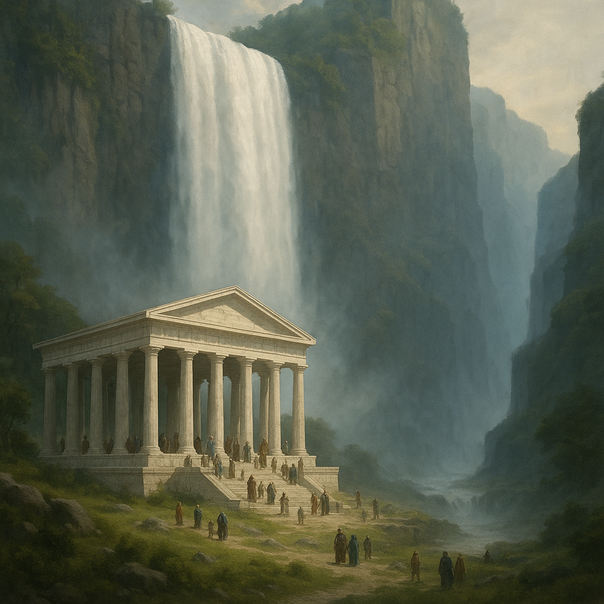

# Aldéra

## Origine et parcours

**Source :** l'Aldéra prend naissance dans les **Collines de l'Écho**, au cœur du **plateau d'Onalpita**. La haute partie du cours d'eau a été annexée par Valcalme au détriment de Khazal. Les riches terres qui bordent le fleuve sur le plateau sont pourtant un des seuls points pour faire paître le bétail et organiser des cultures. Les tensions avec Khazal sont fréquentes et des escarmouches ont lieu tout au long de l'été sur la berge sud. Au nord, les incursions des tribus d'Edravorn sont monnaie courante. Valcalme maintient un régiment dans le village militaire d'**Alcarac** pour maintenir sa mainmise sur cette partie du plateau. La **percée de Draemir** est une vallée minuscule qui part de la ville de Draemir et qui monte vers le plateau avec une grande partie constituée d'escaliers. Il est impossible pour Valcalme de faire monter des militaires rapidement si Edravorn et Khazal venaient à se mettre d'accord pour récupérer cette partie du plateau. Pour Valcalme, il s'agit d'empêcher la construction du barrage promis par le roi Douaric de Khazal il y a deux siècles. La construction de ce barrage pour irriguer le plateau ferait chuter les rendements agricoles dans la basse vallée et mettrait en danger la production des moulins.
 
**Chute majeure :** le **Voile d'Aldéra** est une cascade vertigineuse de près de 1000 mètres qui gronde comme un tonnerre perpétuel. L'éruption qui donna naissance au volcan **Negovar**, à plus de mille kilomètres au sud-est, provoqua un violent tremblement de terre qui souleva une partie du plateau, déviant le cours du fleuve et creusant l'ancienne vallée en canyon sec. La hauteur de la chute fait qu'une brume recouvre en permanence ce canyon depuis le temple d'Istus jusqu'au plateau. Depuis les hauteurs d'Onalpita, on distingue par endroits des **trouées dans la brume**, dont personne ne connaît l'origine.
 
Outre les curieux qui viennent voir l'immense chute d'eau, de nombreux pèlerins se rendent au **temple d'Istus**, situé au pied de cette chute. Le fleuve serpente ensuite paisiblement à travers le **Royaume de Valcalme** avant de se jeter dans l'océan à la capitale **Hroldar**, bâtie autour de son delta.

## Importance

**Économique :** l'Aldéra est la véritable artère de Valcalme. Le fleuve alimente moulins, cultures, commerce fluvial et pêche.

**Politique :** la maîtrise des ponts et passages est une richesse stratégique. 

**Spirituelle :** considéré comme un fleuve sacré, porteur de bénédictions, les prêtres disent que ses eaux « portent les murmures du ciel ».

## Légendes

**Le Voile d'Aldéra :** on raconte qu'un esprit ancien vit derrière la chute d'eau, une nymphe ou une divinité oubliée qui protège (ou maudit) ceux qui osent traverser son rideau liquide. 

**Les Échos :** les Collines de l'Écho doivent leur nom au son du fleuve dans ses gorges, où les voix résonnent comme des chœurs. Les bardes disent que c'est la rivière elle-même qui répond. 

**La Promesse de Valcalme :** selon la légende fondatrice, le premier roi aurait prêté serment sur ses berges. Depuis, chaque souverain de Valcalme doit se purifier dans ses eaux avant d'être couronné à Hroldar.

## Menaces

Les **crues printanières** sont dévastatrices et peuvent emporter des villages entiers. Le **Voile d'Aldéra** attire cultistes et aventuriers qui veulent percer son secret, mais rares sont ceux qui reviennent. On dit que certains **dragons blancs** des Dents du Crépuscule viennent s'abreuver aux sources glacées, traçant des sillons de terreur sur leur passage.
