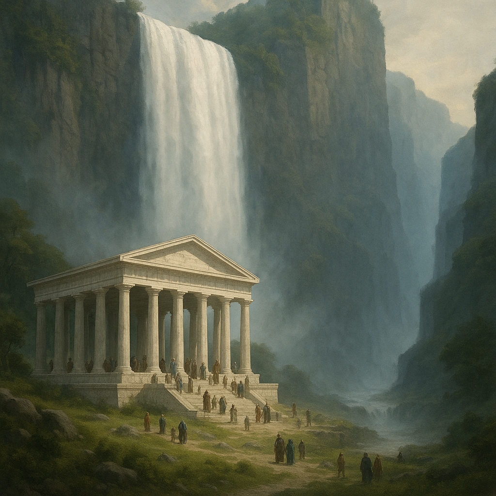

# 🌊 Aldéra – Le Fleuve des Échos

## 📍 Origine et parcours

- **Source :** prend naissance dans les **Collines de l’Écho**, au cœur du **plateau d’Onalpita**.  
- **Chute majeure :** le **Voile d’Aldéra**, une cascade vertigineuse de près de 1000 mètres qui gronde comme un tonnerre perpétuel. Outre les curieux qui viennent voir l'immense chute d'eau, il y a de nombreux pèlerins qui viennent au **temple d'Istus** qui se situe au pied de l'immense chute d'eau de près de 1000m. La hauteur de chute fait qu'une brume recouvre la vallée depuis le temple d'Istus jusqu'à la haute vallée de l'Aldéra dans le canyon par lequel passait le fleuve avant le grand temblement.
- **Trajet :** serpente ensuite paisiblement à travers le **Royaume de Valcalme**.  
- **Embouchure :** se jette dans l’océan à la capitale **Hroldar**, bâtie autour de son delta. 

 

## 🌟 Importance
- **Économique :** véritable artère de Valcalme. Le fleuve alimente moulins, cultures, commerce fluvial et pêche.  
- **Politique :** la maîtrise des ponts et passages est une richesse stratégique.  
- **Spirituelle :** considéré comme un fleuve sacré, porteur de bénédictions. Les prêtres disent que ses eaux « portent les murmures du ciel ».  

## 🗣️ Légendes
- **Le Voile d’Aldéra :** on raconte qu’un esprit ancien vit derrière la chute d’eau, une nymphe ou une divinité oubliée qui protège (ou maudit) ceux qui osent traverser son rideau liquide.
- **Les Échos :** les Collines de l’Écho doivent leur nom au son du fleuve dans ses gorges : les voix y résonnent comme des chœurs. Les bardes disent que c’est la rivière elle-même qui répond.  
- **La Promesse de Valcalme :** selon la légende fondatrice, le premier roi aurait prêté serment sur ses berges. Depuis, chaque souverain de Valcalme doit se purifier dans ses eaux avant d’être couronné à Hroldar.  

## ⚠️ Menaces
- Les **crues printanières** sont dévastatrices et peuvent emporter des villages entiers.  
- Le **Voile d’Aldéra** attire cultistes et des aventuriers qui veulent percer son secret… mais rares sont ceux qui reviennent.  
- On dit que certains **dragons blancs** des Dents du Crépuscule viennent s’abreuver aux sources glacées, traçant des sillons de terreur sur leur passage.  
