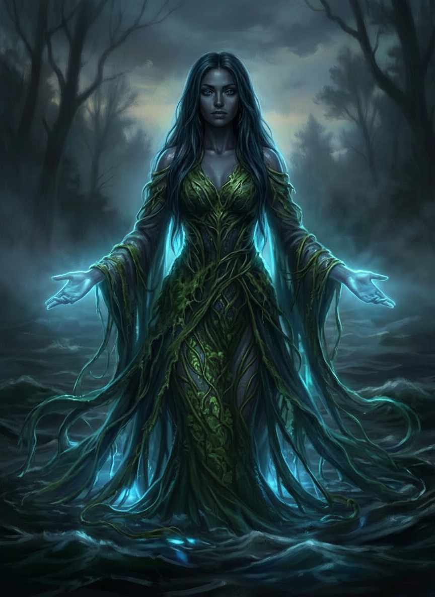
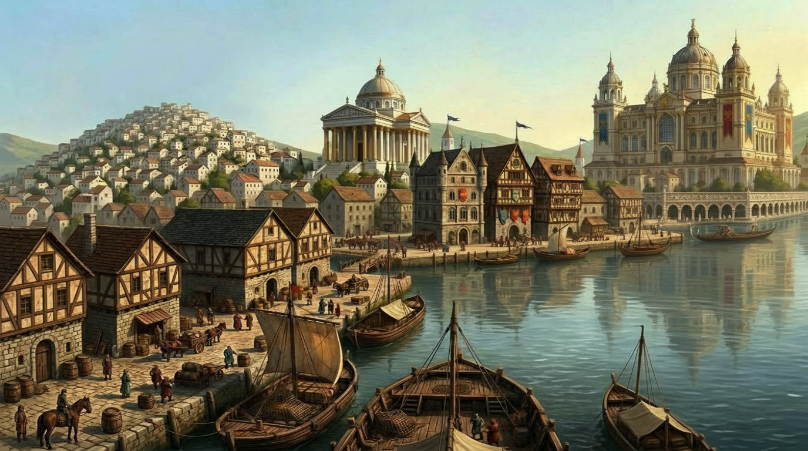

# L'Imrisse

**Résumé :** Né dans les chaos volcaniques des [Dents du Crépuscule](../regions/dents_du_crepuscule.md), l'Imrisse
traverse près de 3000 km avant de se jeter dans l'estuaire de [Siquivorn](../villes/siquivorn.md). Fleuve puissant et
peu méandrant, comparable à la Loire ou au Danube, il est l'artère vitale de
la [Plaine centrale](../regions/plaine_centrale.md) et le territoire sacré de la
déesse [Narhtë](#narhtë-déesse-de-limrisse). Sur ses rives et dans ses eaux vivent des êtres qui ne connaissent pas
d'autre monde.

---

## Source et cours supérieur

L'Imrisse prend sa source dans les hauteurs tourmentées des [Dents du Crépuscule](../regions/dents_du_crepuscule.md),
alimenté par la fonte des neiges et les résurgences volcaniques. Dès sa naissance, le fleuve est violent : rapides,
gorges encaissées, courant imprévisible.

À [Morh-Khaz](../villes/morh-khaz.md), le fleuve est déjà large et puissant, traversant la ville de part en part. Il
reste cependant innavigable jusqu'à [Glounar](../villes/glounar.md) : entre ces deux villes, le courant est trop fort,
les rapides trop nombreux, et les falaises qui bordent le fleuve ne laissent aucune place aux haleurs. Ce tronçon est
connu comme **les Fureurs**, et nul batelier sensé ne s'y aventure.

---

## Le fleuve navigable

À partir de [Glounar](../villes/glounar.md), point de rupture de charge incontournable, le fleuve s'apaise sans perdre
de sa puissance. Le courant reste soutenu, les eaux profondes et sombres. Peu de méandres : l'Imrisse avance droit,
comme s'il savait où il va.

La navigation se fait dans les deux sens entre Glounar et [Siquivorn](../villes/siquivorn.md). Les barges chargées
descendent vite ; la remontée, tractée par des équipes de haleurs ou aidée par des vents favorables, prend deux à trois
fois plus longtemps.

### Les villes du fleuve navigable

**[Ternil](../royaumes/ternil.md)** est la cité marchande qui contrôle une partie du commerce fluvial. Ses manufactures de soie bordent les rives de l'Imrisse, et les teintures aux pigments rares de Hayzgar colorent parfois les eaux en aval. **[Glounar](../villes/glounar.md)**, deuxième ville de Ziven, est un carrefour incontournable : tout ce qui remonte le fleuve depuis Siquivorn s'arrête ici, et tout ce qui descend de l'ouest y est chargé sur des barges. **Orveth** se trouve au bord du point le plus profond du fleuve, avant que l'Imrisse ne se déploie dans son marais ; le fond du fleuve y est insondé et les méervals y sont les plus grands. **[Siquivorn](../villes/siquivorn.md)**, capitale de l'[Empire de Siquimes](../royaumes/siquimes.md), se situe au fond de l'estuaire. Le fleuve s'y dilue dans la mer en une multitude de bras, dont certains ont été creusés par l'homme pour alimenter les canaux de la ville.

---

## Le marais d'Orveth

Au-delà d'Orveth, l'Imrisse cesse d'être un fleuve pour devenir un monde à part entière. Le courant se fragmente en un
**chenal principal** navigable avec prudence, et des **milliers de bras secondaires** qui s'enfoncent dans les roselières
et les sous-bois inondés.

Le marais est dangereux pour qui ne le connaît pas. Les **basilics** y chassent à l'affût, camouflés dans les roseaux. De petites communautés de **saurials** et de **yuan-ti** y vivent, à l'écart du monde, tolérées par Narhtë tant qu'elles respectent les eaux. Les feux follets y sont fréquents, et leur nature reste disputée : esprits égarés, manifestations de drenkels, ou simple phosphorescence des marais ?

Les enfants du fleuve connaissent les passages sûrs et refusent de les indiquer aux étrangers imprudents.

---

## Les enfants du fleuve

Sur l'Imrisse vit une population à part : les **enfants du fleuve**, familles de bateliers qui naissent sur les barges,
grandissent sur les barges, et meurent sur les barges. Leurs enfants ont des enfants à leur tour, qui ne connaissent pas
d'autre maison que le bois des coques et le clapotis de l'eau contre la coque la nuit.

Ils ont leurs propres codes, leurs propres superstitions, et un rapport au fleuve que les habitants des rives ne
comprennent pas vraiment. On ne répond jamais à un appel venu de l'eau après le coucher du soleil. On ne prononce pas le nom d'un noyé récent à bord d'un bateau. On jette une pièce à l'eau quand on passe au-dessus d'une fosse connue. Un mort sur une barge doit être rendu au fleuve selon le rite, jamais enterré en terre, car un corps enterré ne trouve pas Narhtë.

Les enfants du fleuve sont les fidèles naturels de Narhtë, sans temple ni clergé formel. Leur prière, c'est le fleuve
lui-même.

---

## Les ghâts de l'Imrisse

Sur les rives des grandes villes, là où le fleuve est assez large et assez profond, des **escaliers de pierre**
descendent jusqu'à l'eau. Ce sont les ghâts de l'Imrisse, lieux de vie autant que lieux de culte.

On y vient se baigner au lever du soleil. On y lave le linge. On y négocie à voix basse. Et on y rend les morts au
fleuve, selon le rite de Narhtë : le corps posé sur une barque de roseaux, quelques bougies allumées, une prière
murmurée, puis le courant qui emporte tout.

Les ghâts les plus importants se trouvent à Orveth, au bord des eaux les plus profondes. On dit que Narhtë y est
particulièrement présente, que les élémentaires du fleuve y remontent parfois à la surface la nuit, visibles comme des
lueurs bleutées sous l'eau.

## Régate d'Orveth

En plein Lapapacha, au mois de Quinié, l'Imrisse est calme et chaude. La régate se déroule devant les ghâts d'Orveth, là où le fleuve est le plus profond et où Narhtë est réputée particulièrement présente. Les enfants du fleuve y participent en nombre, voyant dans la course un moyen d'obtenir les faveurs de la déesse pour l'année à venir. Les méervals des fosses, les plus grands de tout le fleuve, sont parfois aperçus sous les coques la nuit précédant la course.

---

## Faune et créatures

### Les méervals

Silures géants des eaux profondes, les **méervals** peuvent atteindre plusieurs mètres de longueur. On les rencontre sur
tout le cours navigable, mais les plus grands vivent dans les fosses d'Orveth, où le fond n'a jamais été atteint.

Les enfants du fleuve les respectent sans les craindre vraiment. Un méerval ne s'attaque pas à une barge saine. Il
s'attaque aux corps qui tombent à l'eau, aux animaux qui s'y aventurent, et parfois aux imprudents qui nagent dans les
zones profondes la nuit. Les bateliers lui jettent parfois des offrandes, des restes de repas, comme on saluerait un
voisin.

### Les drenkels

Les **drenkels** sont les noyés que le fleuve n'a pas rendus. Un corps emporté par le courant sans que le rite ait été
accompli, un noyé dont la famille n'a pas pu retrouver le corps, un homme jeté à l'eau sans sépulture : le fleuve les
retient, et avec eux quelque chose qui ressemble encore à ce qu'ils étaient.

Les drenkels imitent des voix. Parfois celles de proches, parfois des pleurs d'enfant, parfois un simple appel au
secours. Ils ne pensent plus vraiment, ils souffrent et ils attirent.

Narhtë est triste de chacun d'eux. Ce ne sont pas ses serviteurs mais ses enfants perdus, incapables de la rejoindre.
Quand les rites sont accomplis après coup, quand une famille retrouve enfin le corps ou accomplit la cérémonie sur l'eau
en l'absence du corps, le drenkel se dissout dans le courant. Les enfants du fleuve disent alors qu'il est "rendu".

### Les élémentaires de l'eau

Sur tout le cours de l'Imrisse, des **élémentaires de l'eau** gardent certains endroits particuliers : une confluence,
une fosse ancienne, un ghât sacré. Ils sont bienveillants par nature et n'attaquent pas les bateaux.

Mais ils observent. Et ce qu'ils observent remonte jusqu'à Narhtë.

Quand le fleuve est souillé, quand des corps y sont jetés sans respect, quand des filets trop larges vident des tronçons
entiers de leur faune, les élémentaires se retirent. Et leur absence est un mauvais signe que les enfants du fleuve
savent lire.

---

## Narhtë, déesse de l'Imrisse

Narhtë est la déesse du fleuve, sœur de [Sunie](#sunie-et-narhtë). Elle a choisi l'ombre librement, sans y être
contrainte, et cette liberté lui est chère. Ses adorateurs sont peu nombreux mais sincères : des bateliers qui lui
parlent le soir sur le pont de leurs barges, des femmes qui viennent aux ghâts au lever du soleil, des prêtres discrets
installés dans les quartiers pauvres des villes du fleuve.

Narhtë aime ses enfants. Elle souffre de chaque drenkel comme d'une blessure ouverte. Elle est patiente, profonde, et
rarement visible. Mais elle n'est pas indulgente.

Un manquement grave commis au nom de sa sœur Sunie, une cruauté exercée sous le couvert du festival, une humiliation
publique trop visible : Narhtë peut choisir d'agir. La personne fautive peut se retrouver à nager dans l'Imrisse sans
comprendre comment. Les drenkels connaissent leur chemin jusqu'à ceux qui les ont créés.

### Sunie et Narhtë

[Sunie](../divinites/sunie.md) est la déesse de l'amour et de la beauté, vénérée dans tout Ziven et particulièrement à
Glounar, où son festival annuel attire les grandes maisons du sous-continent.

Les deux sœurs s'aiment. Narhtë voit ce que le festival a fait de sa sœur : une déesse prisonnière de ses propres
adorateurs, lassée des bijoux horaires brandis comme des armes sociales et des parfums utilisés comme monnaie de
prestige, mais incapable d'abandonner les quelques croyants sincères qui prient vraiment pendant le festival.

Narhtë est plus libre. Elle fait ce que Sunie ne peut pas faire.

---

## Données techniques

**Longueur totale :** environ 3 282 km. **Source :** Dents du Crépuscule. **Embouchure :** estuaire de Siquivorn. **Navigabilité :** de Glounar à Siquivorn (~2 300 km). **Tronçon innavigable :** les Fureurs, entre Morh-Khaz et Glounar. **Point le plus profond :** fosses d'Orveth (profondeur inconnue).

<a href="../../images/glounar.png" class="glightbox" data-gallery="Imrisse"
data-title="Glounar">

