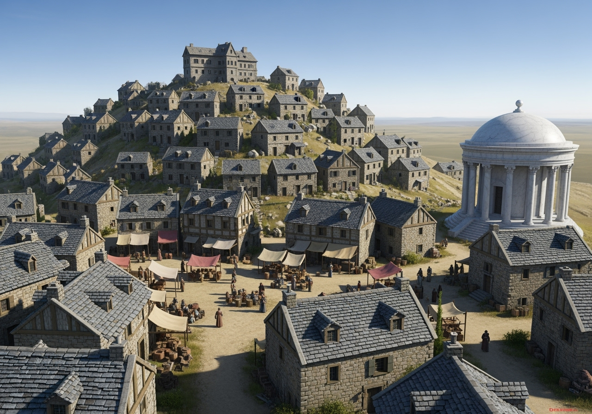

# Manoir d'Outremont

Résidence ancestrale de **la famille de Valmont**, le manoir d'Outremont est perché au sommet de la montagne qui domine
le village de [Rochevent](../villes/rochevent.md). Imposant et austère, il surplombe le plateau
d'[Onalpita](../regions/onalpita.md) et offre une vue imprenable sur les environs.

## Architecture

Le manoir s'organise sur plusieurs niveaux. Le **Rez-de-chaussée** comprend une grande salle de réception, une cuisine, des quartiers des gardes et des pièces de service. L'**Étage** accueille les appartements privés de Lord Edgar de Valmont, des chambres d'hôtes, un bureau et une bibliothèque personnelle. La **Crypte**, au niveau inférieur, abrite les caveaux de la famille de Valmont.

La bâtisse est construite en pierre sombre des collines, contrastant avec le marbre blanc extrait de la carrière voisine qui orne certains éléments décoratifs : colonnes, encadrements de portes et cheminées.

## Défenses

Le manoir est gardé par des **gardes spécialisés**, loyaux à la famille de Valmont. Ils assurent la sécurité du domaine
et patrouillent les abords de la propriété.

## Catacombes

Sous la crypte s'étendent des **catacombes** creusées dans la roche de la montagne. Ces souterrains abritent les
tombeaux anciens de la lignée de Valmont et de familles alliées depuis longtemps disparues. Des tunnels s'enfoncent plus
profondément dans la montagne, dont certains n'ont pas été explorés depuis des générations.
