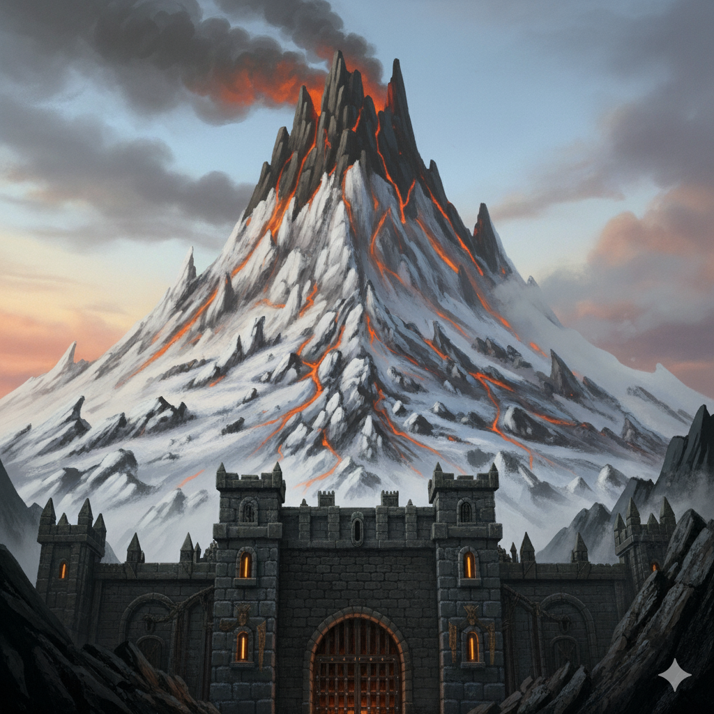

# Négovar – Le Volcan

**Résumé :** Cône noir fumant au sud-est, entouré de collines riches en minerais. Activité volcanique capricieuse et convoitise des puissants.

## Géographie

Cratère instable, coulées anciennes, tunnels de lave. Sous le volcan, la **mine naine** de [Negovarund](../villes/negovarund.md) s’étend en profondeur.

## Points d’intérêt
- **Champs de Cendre**, pâturages minéraux.
- **Autel des Fumées**, promontoire rituel.
- Fumaroles toxiques de **Vael’soufre**.