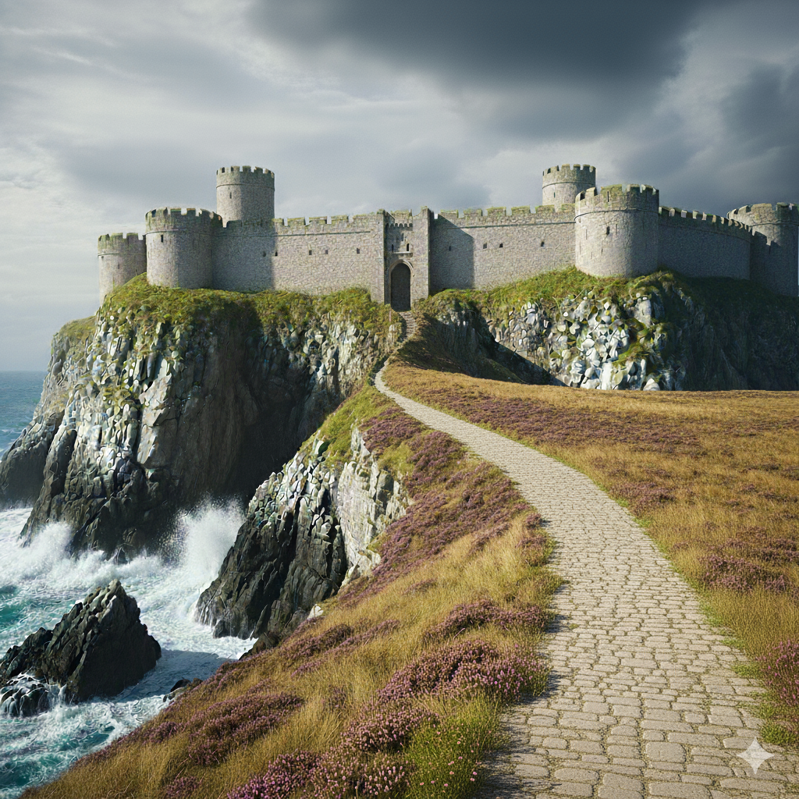

# Cap Poorv et Collines de Poorv

**Résumé :** Extrémité orientale du sous-continent, le Cap Poorv est un promontoire battu par les vents où se dresse une forteresse colossale abritant un contingent militaire commun à tous les royaumes. Les collines environnantes recèlent d'immenses gisements de charbon, exploités par les prisonniers du bagne impérial. C'est un lieu où le froid tue aussi sûrement que les mines.

## Géographie

### Le Cap

Le Cap Poorv marque la jonction entre l'Océan du nord et la [Mer de Narvë](/ziven/docs/regions/mer_de_narve.html). Ce promontoire rocheux s'avance dans les flots comme une lame de granite gris, fouetté en permanence par un **vent austral glacial** qui ne faiblit jamais.

Les falaises plongent à pic dans une mer agitée où les courants se heurtent. Le brouillard est fréquent, rendant la navigation périlleuse. Aucune végétation ne survit sur le cap lui-même ; seuls les lichens s'accrochent aux rochers.

### Les Collines

Les **Collines de Poorv** s'étendent à l'ouest du cap, succession de hauteurs pelées où rien ne pousse. Sous leur surface noire et stérile dorment d'immenses veines de charbon.

Le paysage est lunaire : terre noire, roches sombres, ciel de plomb. Des galeries percent les flancs des collines, bouches béantes d'où sortent les chariots chargés de charbon. La poussière noire recouvre tout, portée par le vent jusqu'à [Poorvichahar](/ziven/docs/villes/poorvichahar.html).

## La Forteresse du Cap

Une **forteresse colossale** se dresse sur l'ultime promontoire, masse anguleuse de granite gris qui semble taillée dans la roche même du cap. Ses murailles semblent avoir poussé là depuis la nuit des temps.

### Statut international

La forteresse abrite un **contingent militaire commun à tous les royaumes** du sous-continent, cas unique de coopération internationale. Cette garnison multinationale surveille les approches orientales et garantit la neutralité du site.

Chaque royaume envoie un détachement, renouvelé tous les deux ans. Un **Commandant de la Garde** est élu parmi les officiers présents pour un mandat d'un an. Les décisions importantes requièrent l'unanimité des représentants royaux.

### Fonctions

La forteresse assure trois fonctions essentielles. La **surveillance maritime** consiste à contrôler le passage entre les deux mers et à signaler les flottes étrangères. En tant que **centre logistique**, elle coordonne l'exploitation minière et le transport du charbon. Enfin, elle remplit un rôle d'**administration pénitentiaire** : le gouverneur du bagne réside dans la forteresse, bien que nommé par l'[Empire de Siquimes](/ziven/docs/royaumes/siquimes.html).

### Passage secret
La forteresse dispose d'un **passage secret**, connu uniquement du gouverneur et de ses plus proches officiers. Cette sortie de secours permet une évacuation discrète en cas de siège ou de mutinerie.

## Les Mines de Charbon

Les **mines de Poorv** constituent la plus grande exploitation charbonnière du sous-continent. Le charbon extrait alimente les forges, les foyers et les industries de tous les royaumes.

### Organisation

Des dizaines de **galeries** s'enfoncent dans les collines, certaines sur plusieurs kilomètres. Le charbon est acheminé par chariots jusqu'à [Poorvichahar](/ziven/docs/villes/poorvichahar.html), à deux jours de marche. La production est supervisée par un **Intendant des Mines**, fonctionnaire impérial répondant au gouverneur.

### Conditions de travail

Les mineurs libres sont rares. L'essentiel de la main-d'œuvre provient du bagne. Les conditions sont effroyables.

Le froid des galeries profondes rivalise avec celui de la surface. Les effondrements sont fréquents, et les équipes de secours inexistantes. La poussière de charbon ronge les poumons en quelques années. Les quotas sont impitoyables : ceux qui ne les atteignent pas perdent leur ration.

## Le Bagne Impérial

### Origine et fonctionnement

Le bagne du Cap Poorv est une institution de l'[Empire de Siquimes](/ziven/docs/royaumes/siquimes.html), maintenue sur le territoire de [Skjoldyr](/ziven/docs/royaumes/skjoldyr.html) par accord tacite avec les mages d'[Arkhazem](/ziven/docs/villes/arkhazem.html). Les condamnés de tout l'Empire y sont envoyés pour des peines allant de quelques années à la perpétuité.

Les prisonniers arrivent par [Poorvichahar](/ziven/docs/villes/poorvichahar.html) après avoir transité par [Dibornad](/ziven/docs/villes/dibornad.html). À leur arrivée, ils sont répartis dans des **cabanons**, des baraques de bois aux toits de tourbe regroupant une vingtaine de détenus. Chaque cabanon est placé sous l'autorité d'un **chef de baraque**, généralement un prisonnier brutal qui maintient l'ordre par la force.

### Hiérarchie des camps

**Le Gouverneur**, nommé par l'empereur, réside dans la forteresse et détient l'autorité suprême sur le bagne. **L'Intendant** administre les camps au quotidien, gère les quotas et les punitions. **Les Gardes**, mélange de soldats impériaux et de mercenaires locaux, surveillent les entrées des mines mais rarement l'intérieur des galeries. **Les Mouchards** sont des prisonniers retournés qui surveillent leurs codétenus en échange de rations supplémentaires. Enfin, **les Mages Pisteurs** sont quelques mages d'[Arkhazem](/ziven/docs/villes/arkhazem.html) qui acceptent des contrats pour traquer les évadés grâce à leurs sorts de localisation.

### Pourquoi personne ne s'échappe

Le bagne est réputé inviolable, non par ses murs mais par son environnement.

**Le froid** tue sans équipement adapté, l'hypothermie survenant en quelques heures. **La distance** est un obstacle majeur : deux jours de marche jusqu'à Poorvichahar, sans abri ni nourriture. **Les loups** rôdent en meutes dans les collines, attirés par l'odeur des camps. **Les marécages** au nord des collines sont des tourbières traîtresses qui engloutissent ceux qui s'y aventurent. Et pour ceux qui survivent à tout cela, **les mages** pisteurs les retrouvent.

### Conditions de vie

La **nourriture** consiste en une bouillie claire la plupart du temps, et en soupe au poulet les jours fastes. Les rations dépendent des quotas atteints : **7 kg de charbon par mineur** pour avoir droit à la soupe, **10 kg pour le poulet**. Le **logement** se résume à des cabanons surpeuplés, chauffés par un unique poêle à charbon qui tire mal, le vent s'infiltrant par les planches disjointes. Le **travail** commence à l'aube avec la descente dans les galeries et s'achève au crépuscule, sept jours sur sept. L'**espérance de vie** est dérisoire : rares sont ceux qui survivent plus de cinq ans.

## Particularités

Le bagne accueille aussi des **prisonniers politiques**, des opposants à l'Empire, des nobles déchus et des témoins gênants. Certains y sont envoyés pour « disparaître » discrètement. Un **bâtiment séparé**, situé près de l'entrée du camp, est réservé aux prisonniers à statut particulier, nobles déchus ou opposants politiques, qui y bénéficient de conditions légèrement moins rudes que dans les cabanons ordinaires.

L'**absence de surveillance intérieure** est notable : les galeries ne sont pas gardées, et les mouchards compensent cette lacune. Certaines **galeries abandonnées**, des tunnels murés depuis des décennies, pourraient mener vers des sorties oubliées. Les anciens mineurs en parlent à voix basse. Enfin, avant les mines, ces collines abritaient les sépultures des seigneurs de guerre des steppes, formant de véritables **tombeaux anciens**. Certaines galeries auraient percé ces tombeaux, libérant, dit-on, des choses qu'il aurait mieux valu laisser dormir.

## Relations avec les environs

**[Poorvichahar](/ziven/docs/villes/poorvichahar.html)** se trouve à deux jours de marche, et tout le charbon y transite. Les convois de prisonniers en arrivent régulièrement. **[Dibornad](/ziven/docs/villes/dibornad.html)** est le port d'embarquement des condamnés venant de l'Empire. Quant à **[Arkhazem](/ziven/docs/villes/arkhazem.html)**, la capitale de Skjoldyr tolère cette enclave impériale, y voyant un arrangement mutuellement profitable.
