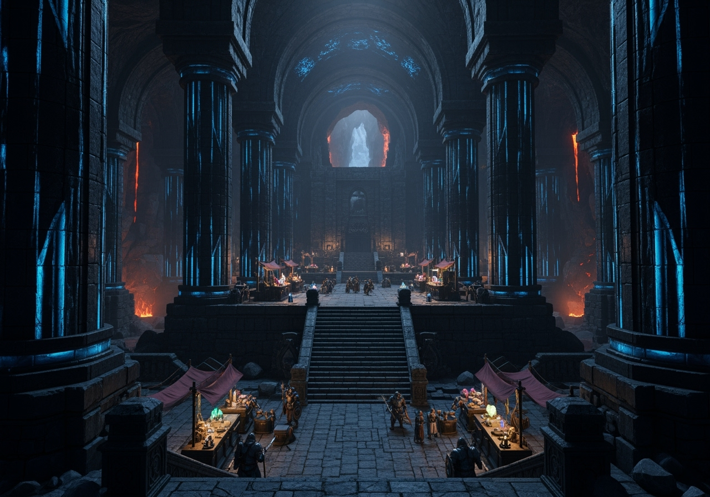
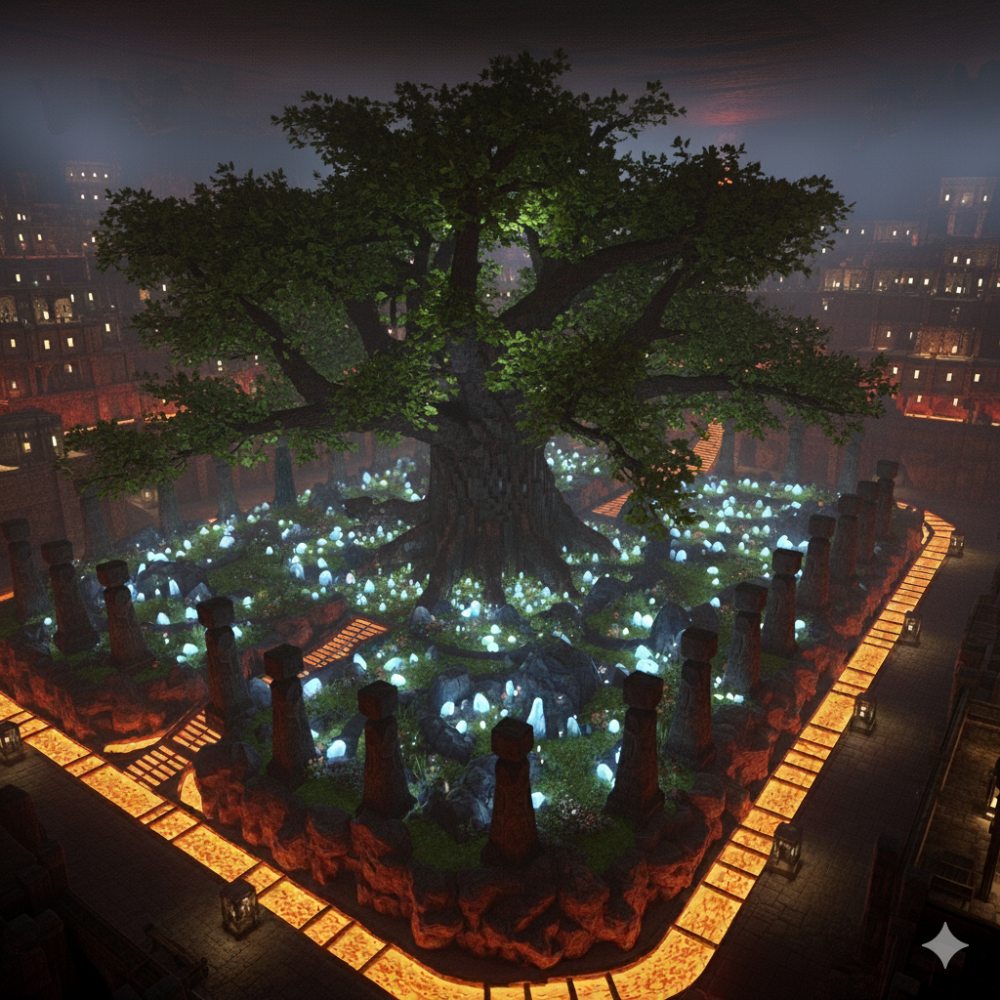
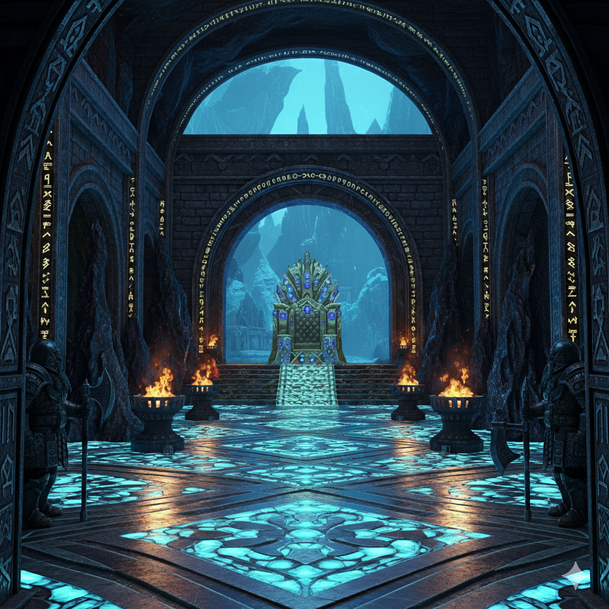

# Les Dents du Crépuscule  

**Type** : Région sauvage (non reconnue comme royaume).  

## Situation générale  
- Territoire ravagé par les **éruptions volcaniques** et les **raids de dragons**.  
- Aucun pouvoir central, aucun royaume ne revendique de droits sur la région.  
- Paysage hostile : pics volcaniques, vallées de cendres, cavernes profondes.  
- Source du fleuve [Imrisse](../fleuves/imrisse.md)

## Peuples présents  
Seules trois espèces humanoïdes y survivent :  
- **Drakéides** : dispersés en petites communautés, mais protecteurs de la **ville-forge de Thuldrem**. Ils défendent la cité contre les dragons en échange de **pierres précieuses**, qu’ils écoulent ensuite via [Tharvell](../royaumes/tharvell.md), mais aussi par la cité-État de [Ternil](../villes/ternil.md) (via Morh-Khaz) ou par [Vaultclos](../royaumes/vaultclos.md) (via [Brennar](../villes/brennar.md) ou [Verdantis](../villes/verdantis.md)).  
- **Goliaths** : semi-nomades, installés autour des **carrières**. En cas d’attaque draconique, ils s’abritent dans des galeries souterraines. La pierre elle-même ne les intéresse pas.  
- **Nains** : répartis en clans, souvent liés à l’exploitation minière ou à la forge.  

## Villes et communautés  
La majorité des habitants vit en **petites communautés isolées**.  
Exceptions :  
- **[Khazrund](../villes/khazrund.md)** : grande ville-mine (plus de 2000 habitants).  
- **Thuldrem** : ville-forge (plus de 2000 habitants), protégée par les drakéides.  

## Caractère de la région  
- Région rude, instable et dangereuse.  
- Population clairsemée mais résiliente.  
- Importance stratégique : ressources minières et gemmes.  

