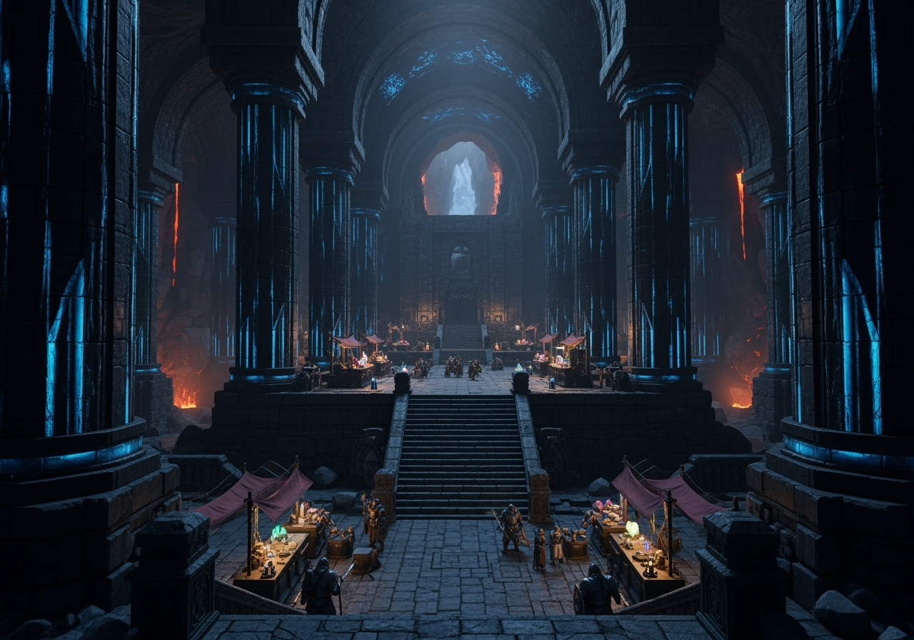
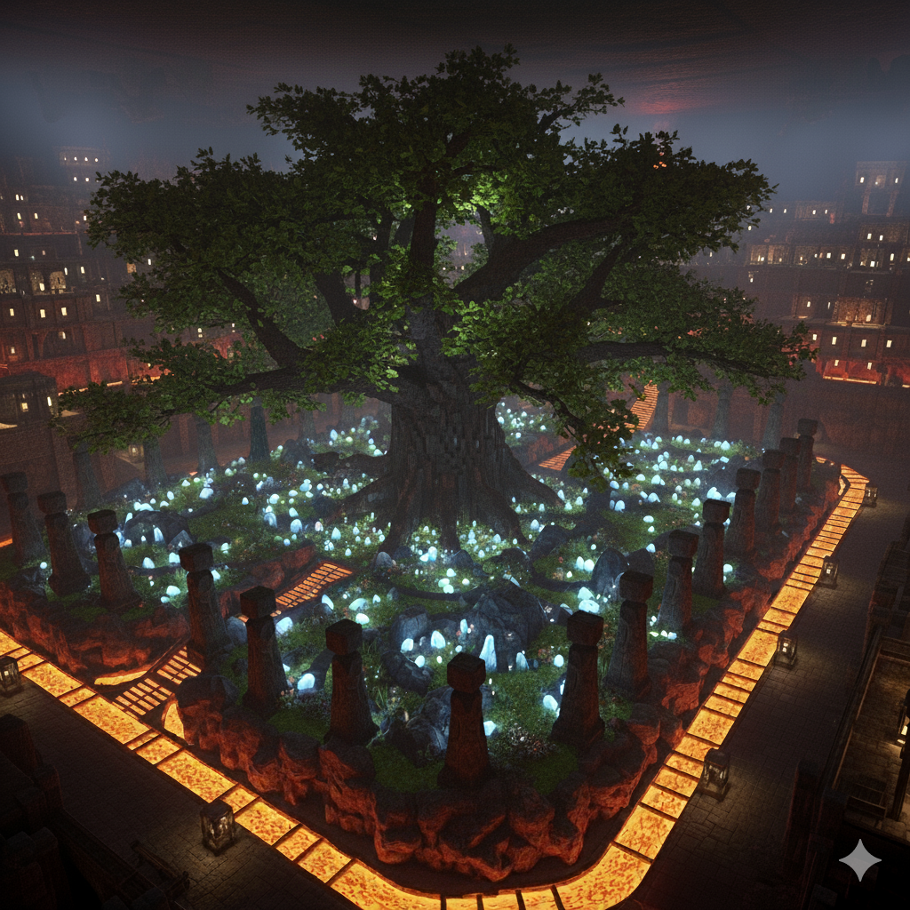
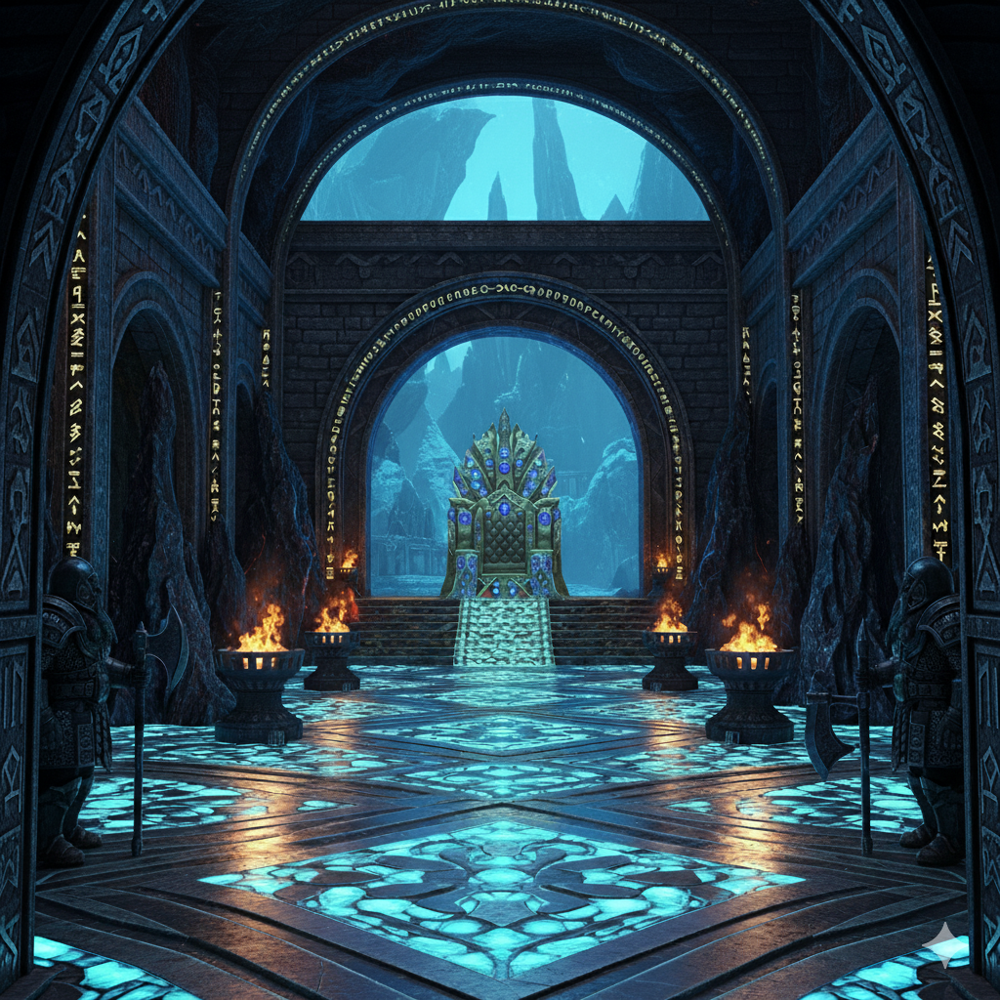

# Les Dents du Crépuscule

**Type** : Région sauvage (non reconnue comme royaume).

## Situation générale

Ce territoire est ravagé par les **éruptions volcaniques** et les **raids de dragons**. Aucun pouvoir central ne s'y exerce, et aucun royaume ne revendique de droits sur la région. Le paysage est hostile, composé de pics volcaniques, de vallées de cendres et de cavernes profondes. C'est également la source du fleuve [Imrisse](../fleuves/imrisse.md).

## Peuples présents

Seules trois espèces humanoïdes y survivent. Les **Drakéides** vivent dispersés en petites communautés, mais protègent la **ville-forge de Thuldrem**. Endurcis par les raids de dragons, ils s'allient régulièrement avec les nains et défendent la cité contre les dragons en échange de **pierres précieuses**, qu'ils écoulent ensuite via [Tharvell](../royaumes/tharvell.md), mais aussi par la cité-État de [Ternil](../villes/ternil.md) (via Morh-Khaz) ou par [Vaultclos](../royaumes/vaultclos.md) (via [Brennar](../villes/brennar.md) ou [Verdantis](../villes/verdantis.md)). Les **Goliaths** sont semi-nomades, installés autour des **carrières**. En cas d'attaque draconique, ils s'abritent dans des galeries souterraines, et la pierre elle-même ne les intéresse pas. Les **Nains**, maîtres mineurs et métallurgistes, sont répartis en clans liés à l'exploitation minière ou à la forge ; leurs réseaux commerciaux, risqués mais lucratifs, alimentent les marchés de Ternil et de Vaultclos.

## Villes et communautés

La majorité des habitants vit en **petites communautés isolées**. Deux exceptions notables se distinguent : **[Khazrund](../villes/khazrund.md)**, une grande ville-mine de plus de 2000 habitants, et **Thuldrem**, une ville-forge de plus de 2000 habitants, protégée par les drakéides.

## Caractère de la région

La région est rude, instable et dangereuse. Sa population est clairsemée mais résiliente. Son importance stratégique tient à ses ressources minières et à ses gemmes.

