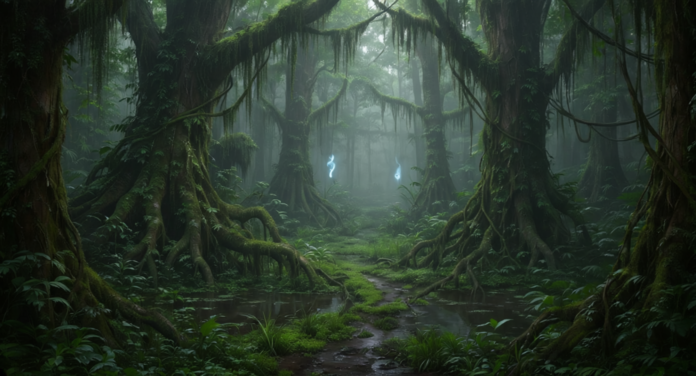

# Forêt de Morness

## Géographie

La forêt de Morness s'étend d'est en ouest sur une large bande au sud de deux des Trois Sœurs Ennemies, **[Dorna](../royaumes/dorna.md)** et **[Calmorra](../royaumes/calmorra.md)**. Sa frange occidentale coupe le royaume de **[Vaultclos](../royaumes/vaultclos.md)** en deux, séparant la capitale **[Verdantis](../villes/verdantis.md)** (au
nord de la forêt) du reste de son territoire méridional.

Elle est humide, légèrement marécageuse dans sa partie centrale, et surnommée **"la forêt des larmes"** à cause de la
rosée qui goutte en permanence des arbres comme des pleurs. Le climat y est chaud et lourd, typique des latitudes
septentrionales de l'hémisphère sud. Les **Hodirs** y poussent naturellement, ces arbres ont des fleurs au parfum
envoûtant qui peut faire entrer en transe n'importe qui au moment de la floraison. Les druides de **[Skjorren](../villes/skjorren.md)** s'en
servent
pour entrer dans une transe divinatoire.

### Voyage à travers la forêt

Les routes terrestres sont rares et plutôt dangereuses. Malgré la piraterie, relier Verdantis au reste de la côte Nord
est moins dangereux par la mer que par la forêt de Morness. La route des six marais qui relie Verdantis à Calmorra et
Dorna n'est plus sécurisée depuis longtemps et un basilic n'est pas la pire rencontre que vous puissiez faire. Du Nord
au Sud, la route des larmes, sécurisé par Vaultclos est la seule à pouvoir être considérer comme praticable. La route du
col de Mara est dangereuse autant dans la forêt que près de la tour de Mara qui serait peuplée de fantômes.

La navigation sur les cours d'eau est en partie possible mais lente et toute aussi dangereuse que sur les routes.
L'Imdorna, le fleuve qui coule jusqu'à Dorna est connu pour transporter le poison des drows. Certains disent qu'il y a
plus de poison que d'eau qui coule sur ce fleuve à faible débit.

#### La route des larmes

La **Route des Larmes** la traverse du Nord au Sud pour relier Verdantis au reste de Vaultclos. Seule voie
correctement gardée, elle reste dangereuse hors des postes de contrôle mais constitue le passage obligé au pied des
[dents du crépuscule](dents_du_crepuscule.md) quand on veut voyager entre le Nord et le Sud.

Son nom vient de la rosée qui tombe des branches en permanence et mouille les voyageurs comme une pluie fine et
constante tout au long du trajet.

### Zones

**Frange nord (bordure de Verdantis et des cités côtières)**

- Zone la plus accessible, partiellement défrichée aux abords des routes.
- C'est ici que se trouvent la plupart des sanctuaires et villages en lisière.

**Cœur marécageux (partie centrale)**

- Zone la plus dangereuse. Les marais y rendent les sentiers instables, changeants, parfois inexistants.
- Sortir des rares sentiers balisés est presque aussi dangereux que de les suivre.
- Visibilité réduite, brume permanente, sons trompeurs.
- Les feux follets y sont nombreux et attirent les imprudents vers les zones les plus profondes.

**Frange est (bordure de Dorna)**

- Forêt plus dense, moins marécageuse mais tout aussi opaque.
- Zone d'implantation principale des villages drows.
- Des ateliers alchimiques clandestins y opèrent, prélevant des plantes sacrées sans respect des équilibres naturels.

---

## Factions et occupants

### Les Drows de Morness

Arrivés par bateau il y a plusieurs générations, d'abord chassés par les populations de Dorna, puis acceptés pour leur *
*immunité naturelle aux poisons** et leur maîtrise inégalée des toxines. Ils se sont installés dans des villages
discrets à l'orée de la forêt, principalement côté Dorna.

Leur commerce est le moteur économique invisible de toute la région : la **larme de minuit** et d'autres poisons
dorniens que l'on retrouve dans tout le sous-continent viennent de leurs mains. Ce commerce n'apparaît dans aucun
registre officiel mais représente une part considérable de l'économie de Dorna.

Les Drows ont un intérêt direct à ce que Morness reste **impénétrable et préservée** et ce n'est pas par amour de la
nature, mais parce que leur monopole sur les plantes repose sur l'inaccessibilité de la forêt. Ils tolèrent les
sylvaniens (qui servent leurs intérêts sans le savoir), se méfient des ateliers alchimiques clandestins (concurrents
potentiels), et combattent activement toute tentative d'exploration organisée de leur frange est.

Ils produisent plus de poisons que tout le reste du sous-continent réuni. Les magiciens d'**[Arkhazem](../villes/arkhazem.md)** sont parmi leurs
meilleurs clients indirects, via les marchands de Dorna.

### Les Sylvaniens

Entités végétales protectrices de la forêt, les sylvaniens veillent à ce que Morness ne soit ni déboisée ni brûlée. Leur
motivation est fondamentalement différente de celle des Drows : ils protègent la forêt en tant que telle, pas pour des
raisons commerciales.

En pratique, leurs intérêts convergent souvent avec ceux des Drows : ni l'un ni l'autre ne souhaitent de routes
nouvelles, d'exploitations forestières ou d'incendies. Cette convergence ne se traduit pas par une alliance mais par une
coexistence fonctionnelle.

Les sylvaniens interviennent rarement hors de la forêt, mais leur réaction à toute tentative de coupe ou de feu est
rapide et disproportionnée selon les standards humains. Plusieurs expéditions de bûcherons mandatées par Vaultclos ont
disparu sans laisser de traces.

### Les sanctuaires forestiers

Le cœur de la forêt abrite des sanctuaires anciens, certains actifs, d'autres abandonnés. es sanctuaires entretiennent
un lien avec les cycles naturels de la forêt et constituent des refuges pour ceux qui savent les trouver.

Les sanctuaires se trouvent au plus profond la forêt, loin des routes et il est déconseiller d'essayer d'y accéder sans
y être préalablement préparé. Sur place, il y a souvent un village qui entoure le sanctuaire avec une auberge et des
commerces rudimentaires.

**Sylvanus**, **Mailikki** ou **Eldath** ont même des petits temples dans certains de ces sanctuaires. Il
est possible de trouver des sanctuaires dédiés à **Lolth** dans la partie occupée par les drows mais son sanctuaire et
le
village qui se développe autour sont strictement réservés à ses adorateurs les plus fervents. Enfin, dans une caverne du
sud-est
au pied du [massif du nord](massif_du_nord.md) se trouverait un sanctuaire à Talona, la déesse de la maladie et du poison.

### Les ateliers alchimiques clandestins

Présents à l'est de la forêt, ces ateliers prélèvent des plantes sacrées sans respect des équilibres naturels ni des
pratiques drows. Leur identité est incertaine. S'agit-il de commanditaires extérieurs ? D'une faction dissidente ? Ils
représentent une
menace à la fois pour les Drows (concurrence et surexploitation), les sylvaniens (prélèvements destructeurs) et les
druides/clercs (profanation des plantes sacrées).

---

## Faune

### Basilics

Présents sur l'ensemble du territoire forestier, particulièrement dans les zones rocheuses de la frange nord. Leur
regard pétrifiant en fait l'une des menaces les plus redoutées des voyageurs inexpérimentés.

### Hydres

Créatures des marais centraux. Plusieurs individus sont connus et territoriaux. Les gardes de la Route des Larmes ont
appris à cartographier leurs zones approximatives mais celles-ci bougent avec les saisons.

### Tribus de saurials

Plusieurs tribus de saurials occupent la forêt, principalement dans les zones marécageuses et les sous-bois denses. Leur
rapport aux autres occupants de Morness est complexe : ni alliés des Drows, ni ennemis déclarés des sylvaniens. Ils
tolèrent peu les incursions dans leurs territoires et répondent aux intrusions par des raids rapides et silencieux.
Certains chamans saurials auraient des accords tacites avec les guenaudes vertes.

### Feux follets

Concentrés dans le cœur marécageux. Attirent les voyageurs hors des sentiers, parfois jusqu'à la noyade, parfois
jusqu'aux zones tenues par les guenaudes. Leur origine est inconnue — esprits de voyageurs perdus, créatures
indépendantes, ou serviteurs d'une puissance plus ancienne. Les Drows les considèrent comme des gardiens involontaires
et ne cherchent pas à les éliminer.

### Guenaudes vertes

Présentes dans les profondeurs marécageuses de la partie centrale. Au moins trois covens sont connus, peut-être
davantage. Elles connaissent la forêt mieux que quiconque et ont des rapports ambigus avec les Drows — ni alliance
franche, ni hostilité ouverte. Elles achètent parfois des ingrédients rares aux alchimistes clandestins de la frange est
et semblent intéressées par tout ce qui touche aux plantes sacrées.

