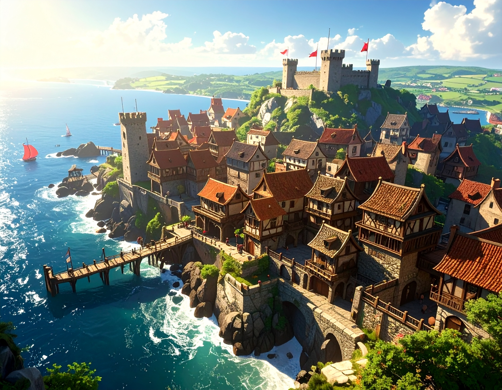

# Cité-État de Calmorra  

**Type** : Cité portuaire marchande  
**Position** : La plus occidentale des *Trois Sœurs Ennemies*  

## Résumé  
Ancienne cité de pêcheurs devenue port marchand prospère, **Calmorra** garde une réputation plus « populaire » que ses voisines. Sa noblesse est jugée moins raffinée, mais redoutée pour ses alliances imprévisibles et ses coups de main brutaux.  

## Politique et société  
- **Dirigeante** : une **dogaresse** d’une quarantaine d’années, ancienne capitaine de mer.  
- Elle a accédé au pouvoir après le fameux **banquet des retrouvailles**, organisé par son frère, tyran impopulaire. Beaucoup pensent qu’elle l’a empoisonné, mais nul n’ose l’accuser ouvertement.  
- La république est **globalement isolée** :  
  - **[Vaultclos](vaultclos.md)** perd trop de navires à cause du laxisme envers la piraterie.  
  - **[Siquimes](siquimes.md)** tente d’exercer des pressions diplomatiques pour mettre fin aux attaques, sans succès réel.  
  - **[Dorna](dorna.md)** n’entre pas dans ses priorités.  

## Économie et ressources  
- Port ouvert aux cargaisons douteuses, attirant contrebandiers et capitaines peu scrupuleux.  
- Refuge pour pirates : les navires qui ne trouvent accueil nulle part ailleurs trouvent asile ici.  
- Tout se vend, tout s’achète : marché parallèle actif, parfois plus puissant que les institutions officielles. *Peu importe l'origine de la marchandise, s'il y a un vendeur, il y a un acheteur !* 
- Ressources locales :  
  - **Plaine côtière fertile** offrant des terres agricoles.  
  - **Partie de la forêt de Morness**, exploitée avec parcimonie pour le bois, mais aussi refuge de légendes et de créatures.  

## Ordre et sécurité  
- La ville **n’est pas chaotique** : la garde veille et empêche les querelles internes de dégénérer.  
- Le but est clair : voler les riches cités voisines, pas s’entretuer.  
- Les luttes intestines existent, mais surtout entre les plus grands marchands.  
- **Chef de la garde** : un goliath célèbre pour avoir arrêté huit gnomes chapardeurs avec un seul bras.
- Calmorra doit son indépendance et sa sécurité à l'alliance tacite des pirates et des marchands. Dorna ou Lomirra tente parfois des raids voire une annexion mais la piraterie fait alors place à la défense.

## Diversité et tolérance  
- Refuge des communautés marginalisées ailleurs : tieffelins, gnomes, halfelins, aasimar, drows, goliaths, orcs.  
- Cosmopolitisme imposé par la mer et la piraterie, tolérance rare dans les autres cités-états.  

## Culture et rumeurs  
- **Cité de marins** : chants de taverne, récits de tempêtes, superstitions maritimes omniprésentes.  
- **Cité de rumeurs** : informateurs nombreux et souvent fiables, mais aux tarifs élevés.  
- Légendes marines et récits exagérés circulent aussi vite que les cargaisons de contrebande.  

---
