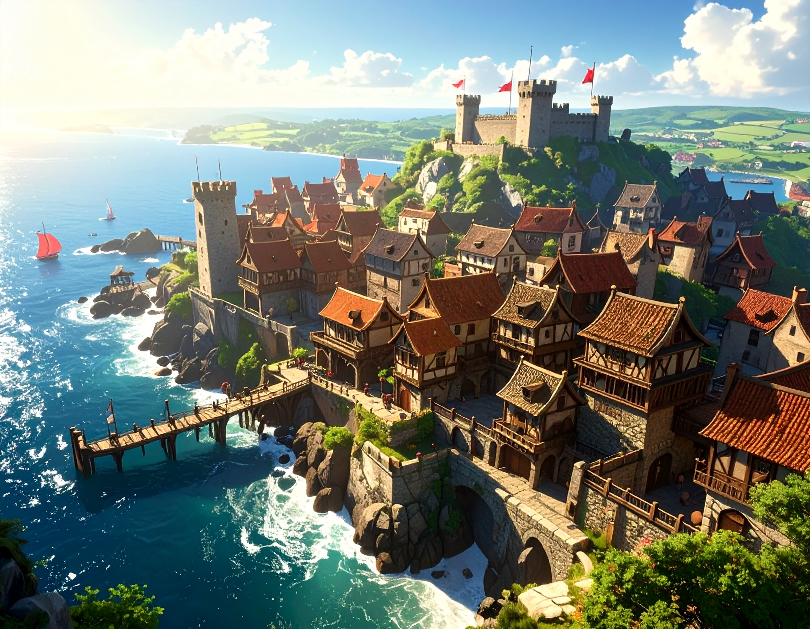

# Cité-État de Calmorra

**Type** : Cité portuaire marchande
**Position** : La plus occidentale des *Trois Sœurs Ennemies*

## Résumé

Ancienne cité de pêcheurs devenue port marchand prospère, **Calmorra** garde une réputation plus « populaire » que ses
voisines. Sa noblesse est jugée moins raffinée, mais redoutée pour ses alliances imprévisibles et ses coups de main
brutaux.

## Politique et société

La cité est dirigée par une **dogaresse** d'une quarantaine d'années, ancienne capitaine de mer. Elle a accédé au pouvoir après le fameux **banquet des retrouvailles**, organisé par son frère, tyran impopulaire. Beaucoup pensent qu'elle l'a empoisonné, mais nul n'ose l'accuser ouvertement.

La république est **globalement isolée**. **[Vaultclos](vaultclos.md)** perd trop de navires à cause du laxisme envers la piraterie. **[Siquimes](siquimes.md)** tente d'exercer des pressions diplomatiques pour mettre fin aux attaques, sans succès réel. **[Dorna](dorna.md)** n'entre pas dans ses priorités.

## Économie et ressources

Le port est ouvert aux cargaisons douteuses, attirant contrebandiers et capitaines peu scrupuleux. Calmorra sert de refuge pour les pirates : les navires qui ne trouvent accueil nulle part ailleurs trouvent asile ici. Tout se vend, tout s'achète, le marché parallèle étant parfois plus puissant que les institutions officielles. *Peu importe l'origine de la marchandise, s'il y a un vendeur, il y a un acheteur !*

Côté ressources locales, la cité dispose d'une **plaine côtière fertile** offrant des terres agricoles, ainsi que d'une **partie de la forêt de Morness**, exploitée avec parcimonie pour le bois, mais aussi refuge de légendes et de créatures.

## Ordre et sécurité

La ville **n'est pas chaotique** : la garde veille et empêche les querelles internes de dégénérer. Le but est clair, voler les riches cités voisines, pas s'entretuer. Les luttes intestines existent, mais surtout entre les plus grands marchands. Le **chef de la garde** est un goliath célèbre pour avoir arrêté huit gnomes chapardeurs avec un seul bras. Calmorra doit son indépendance et sa sécurité à l'alliance tacite des pirates et des marchands. Dorna ou Lomirra tente parfois des raids voire une annexion mais la piraterie fait alors place à la défense.

## Diversité et tolérance

La cité est un refuge des communautés marginalisées ailleurs : tieffelins, gnomes, halfelins, aasimar, drows, goliaths, orcs. Ce cosmopolitisme est imposé par la mer et la piraterie, une tolérance rare dans les autres cités-états.

## Culture et rumeurs

Calmorra est avant tout une **cité de marins**, où chants de taverne, récits de tempêtes et superstitions maritimes sont omniprésents. C'est aussi une **cité de rumeurs** : les informateurs y sont nombreux et souvent fiables, mais leurs tarifs sont élevés. Légendes marines et récits exagérés circulent aussi vite que les cargaisons de contrebande.

---
