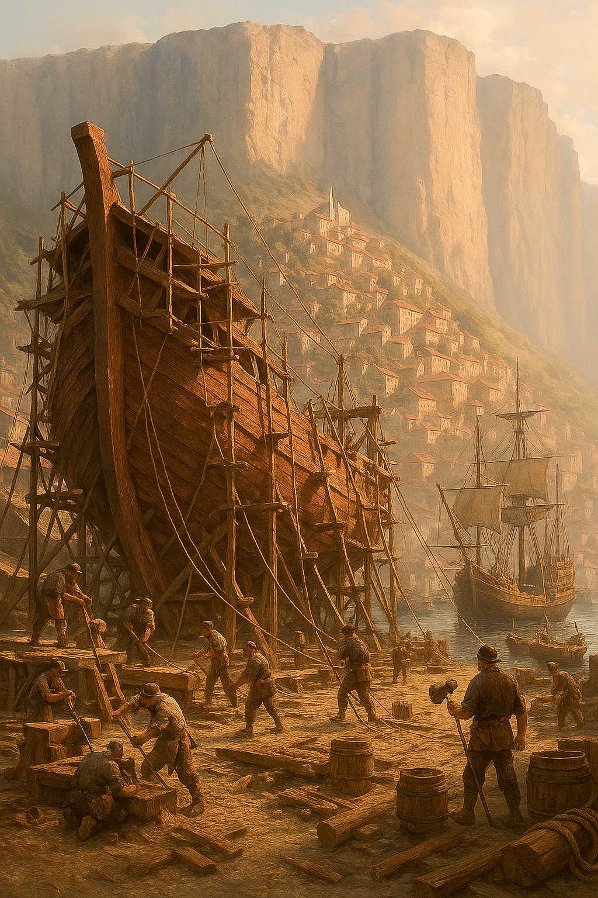

# Cité-État de Grimstad

**Type** : République ouvrière maritime
**Richesse principale** : Construction navale

## Résumé
Grimstad est une cité portuaire réputée pour ses chantiers navals. Elle contrôle l'une des plus grandes flottes marchandes du sous-continent et attire les artisans et charpentiers de toute la région. Sa prospérité repose sur la transformation du bois d'**Igrodia**, un conifère géant au bois dur, idéal pour les coques de navires.

## Politique
La cité-état se distingue par son gouvernement : un **Collège des Travailleurs**, composé de représentants des confédérations ouvrières (charpentiers, forgerons, cordiers, voiliers…). Les mandats sont **d'une année seulement**, garantissant une rotation fréquente du pouvoir et une forte implication populaire.

## Relations extérieures

Les relations avec **[Valcalme](valcalme.md)** (à l'ouest) sont cordiales, avec des échanges commerciaux soutenus. **[Edravorn](edravorn.md)** (au sud) offre un accès à la mer et sert de relais pour les tribus commerçantes. Avec **Tharvell**, les relations sont indirectes, passant par le commerce de l'Igrodia qui transite par le royaume de Siquimes.

## Fête de la proue

Au début de la Sniegapacha, en Déquié, les trois grands chantiers navals de Grimstad s'affrontent pour le titre de la plus belle proue de l'année. Exposée sur les quais pendant plusieurs jours, la proue gagnante est désignée par l'ensemble des ouvriers des confédérations, dans l'esprit du Collège des Travailleurs qui gouverne la cité. La récompense est de 3000 pièces d'or, et la compétition envahit toute la ville pendant plusieurs jours dans une ambiance passionnée et festive.
