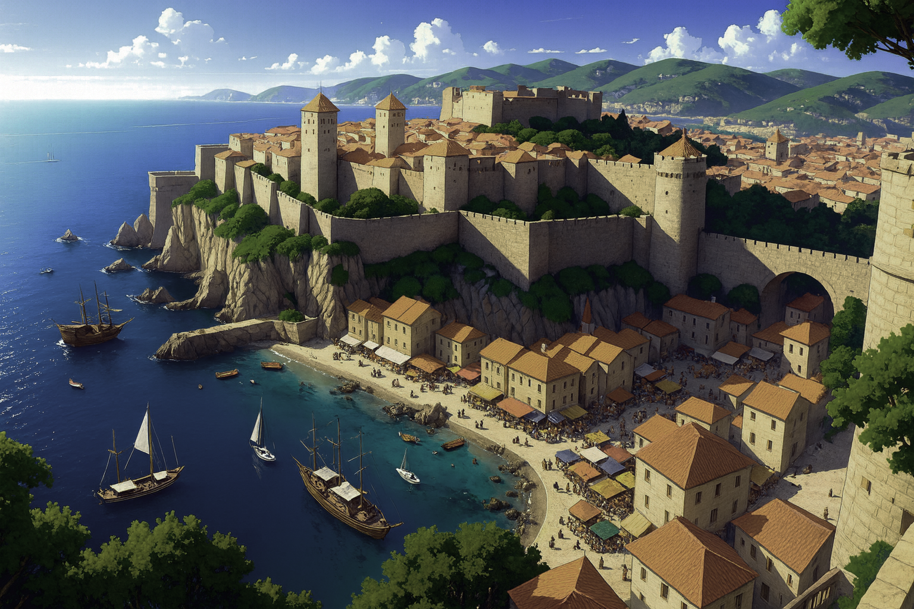

# Cité-État de Lomirra  
**Type** : Cité-État maritime (Trois Sœurs ennemies)  

## Résumé  
La plus orientale et la plus militarisée des Trois Sœurs. Sa flotte est la mieux organisée et son arsenal redouté sur toutes les mers de la région. Les intrigues politiques y sont moins sophistiquées qu’à [Dorna](./dorna.md), mais sa puissance martiale compense largement : quand Lomirra agit, c’est souvent par la force.  

Proche voisine de [Siquivorn](../villes/siquivorn.md), elle entretient des relations constantes mais souvent tendues avec le grand royaume marchand.  

## Relations diplomatiques  
- Relations cordiales avec [Grimstad](./grimstad.md), principal client de ses chantiers navals.  
- Relations tendues avec [Siquimes](../royaumes/siquimes.md).  

## Société et armée  
- La conscription est longue mais rémunératrice, faisant de l’armée un pilier de la cité.  
- Les soldats consomment une piquette produite dans les coteaux du [massif du nord](../regions/massif_du_nord.md). Peu appréciée, mais faute de vin de [Valcalme](../royaumes/valcalme.md), réservé aux officiers, elle reste la boisson courante.  

## Dynastie  
- La dynastie **Mérudo** règne depuis plus de cinq siècles, ce qui en fait la seconde plus ancienne dynastie du sous-continent.  
- Particularité : un demi-elfe a occupé le trône durant 12 ans.  

## Économie et commerce  
- Cœur économique : le **bazar de Goradir**, le marché le plus actif de Ziven.  
- Approvisionné par les familles nomades et le commerce portuaire.  
- Réputation de receler des marchandises venues de tout Ziven, des autres continents, voire d’autres plans.  

---
*Ce que tu ne peux acheter, tu dois le conquérir*