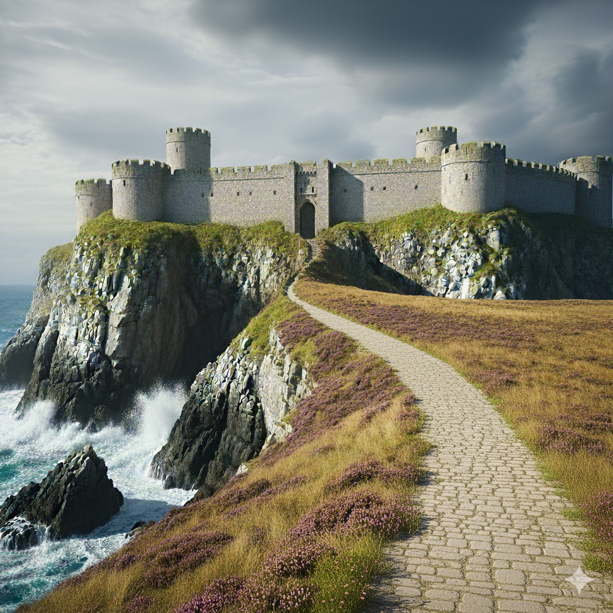

# Royaume de Skjoldyr  
**Type** : Royaume gouverné par une guilde de magiciens et ensorceleurs  

## Capitale  
- **Arkhazem** — Ville-pont monumentale enjambant le canyon de l’Imgodir à plus de 1000 m de hauteur. Centre politique et magique du royaume.  
  La ville accueille deux des écoles majeures du sous-continent : celle de magie et celle d’architecture.  
  La liberté de créativité qui y règne attire les plus grands talents, malgré les efforts de Siquivorn pour concurrencer son influence.  
  Arkhazem est aussi une ville académique, abritant l’école de musique de la grande guilde des bardes.  

## Géographie  

- **[Cap Poorv](../lieux/fort_de_poorv.md)** — Extrémité orientale du sous-continent, battue par un vent austral glacial et permanent. Une forteresse colossale y abrite un contingent commun de tous les royaumes.  
- **Mine de Poorv** — Immense exploitation charbonnière proche du cap Poorv, flanquée d’un bagne. Le charbon y est acheminé vers le reste du sous-continent par **Poorvichahar**, ville caravanière située à deux jours de marche.  
- **Vallée de l’Imgodir** — Chaude et souvent noyée de brume, en contraste avec les hauts plateaux glacés d’Onalpita qui la bordent.  

## Villes principales  
- **Arkhazem** — Capitale, ville-pont surplombant l’Imgodir.  
- **Norvik** — Ville au bord du lac des Murmures.  
- **Eiswynn** — Ville lacustre jumelle de Norvik.  
- **[Dibornad](../villes/dibornad.md)** — Port fluvial à l’embouchure de l’Imgodir.  
- **[Poorvichahar](../villes/poorvichahar.md)** — Ville de transit du charbon venant du cap Poorv.  

## Économie  
- La vallée de l’Imgodir sert de grenier aux hauts plateaux. Le développement urbain y est strictement codifié et les terres y sont très chères.  
- Les côtes de Skjoldyr comptent parmi les eaux les plus poissonneuses du sous-continent ; la pêche y représente une ressource notable.  
- La véritable richesse du royaume repose cependant sur la **confection et le commerce d’objets magiques**, source de prestige et de revenus.  

## Particularités  
- Forteresse internationale au cap Poorv.  
- Société marquée par le froid et la rudesse des plateaux.  
- Arkhazem est un haut lieu académique, accueillant les plus grandes écoles de magie, d’architecture et de musique.  
- Pouvoir central détenu par une guilde de magiciens et ensorceleurs, dont l’influence se fait sentir jusque dans la vie quotidienne.  
