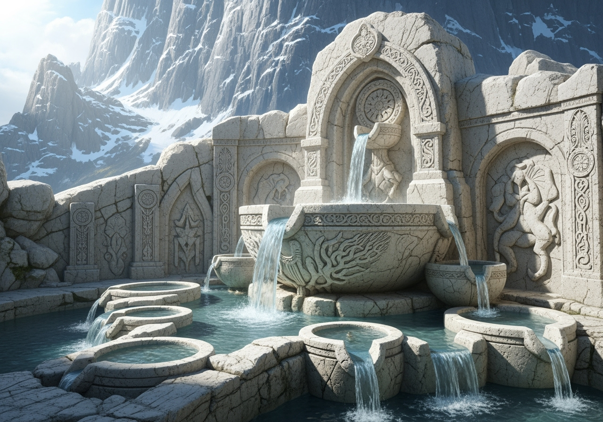

# Royaume de Tharvell

**Type** : Royaume forestier.

## Situation générale

Tharvell est un royaume situé aux abords des **Dents du Crépuscule**, sans mines d'ampleur, mais riche en ressources naturelles. Ses deux richesses principales sont les **pierres précieuses** issues du commerce avec les drakéides de Thuldrem et le **bois d'Igrodia**, conifère gigantesque atteignant jusqu'à **250 m de hauteur**, réputé pour sa solidité exceptionnelle.

## Ressources et commerce

Les **pierres précieuses** sont revendues via les grands axes commerciaux. Le **bois d'Igrodia** est très recherché pour la **construction navale** (notamment les chantiers de [Grimstad](../villes/grimstad.md)), mais aussi pour l'architecture monumentale. Son transport est complexe et coûteux, réservé aux clients les plus puissants. Un **rituel de coupe** encadre son exploitation : avant d'abattre un arbre, les bûcherons doivent apporter à Idingrodia **100 litres d'eau** puisée à la **source sacrée d'Ilagdir**, située à plus de 500 km au pied du glacier du même nom. Cette source est gardée par les **druides**, qui veillent au respect du rite.

## Capitale, Skjorren

Skjorren est une ville construite **autour d'un vaste parc sacré** où pousse un Igrodia millénaire, nommé **Idingrodia**. L'âge de cet arbre est estimé à **1500 ans** (soit seulement un dixième de sa durée de vie) et sa hauteur actuelle atteint près de **100 m**. Il est protégé par un immense espace libre de toute construction pour ne pas fragiliser ses racines.

Des **cérémonies druidiques** s'y tiennent régulièrement : des druides venus de tout le sous-continent se réunissent périodiquement pour entrer en **symbiose** avec l'arbre, qu'ils considèrent comme un être vivant sacré, centre spirituel du royaume. Selon la **légende d'Osgin**, l'arbre aurait été planté par le druide **Osgin** et, d'après les traditions orales, celui-ci vivrait encore **au cœur de l'arbre**, veillant sur Tharvell et ses habitants.

> Voir la page dédiée : [Skjorren](../villes/skjorren.md)

## Pouvoir et société

Le royaume est gouverné par la noblesse, notamment la **famille Vilamidar**. Toutefois, **aucune décision importante** ne peut être prise sans l'assentiment des **druides**, gardiens des forêts et des traditions. L'autorité druidique s'exerce via la **Grande Voix** et un **conseil de onze druides** siégeant au Collège druidique de Skjorren, institution respectée et crainte dans tout le royaume. Cet équilibre entre noblesse et druidisme façonne toute l'organisation du royaume.

## Relations extérieures

**Khazal (à l'est)**, **Ternil** et **Siquimes (au nord)** respectent les traditions de Tharvell et ses rites druidiques. **Valcalme (au nord)**, bien que respectueux en apparence, nourrit des **ambitions de mainmise sur les forêts d'Igrodia**. Le bois d'Igrodia est indispensable à la construction navale valcalmienne, et les armateurs de [Hroldar](../villes/hroldar.md) cherchent à s'affranchir du contrôle druidique sur les coupes. Les échanges commerciaux renforcent la stabilité diplomatique, mais la richesse du bois reste convoitée.

## Le sud de Tharvell

Le sud est une région peu peuplée, soumise aux **glaces** et aux **attaques de dragons**. On y trouve seulement quelques **villages de chasseurs et pêcheurs**, souvent isolés. Ces communautés ne reconnaissent pas toujours l'autorité du nord, mais il n'existe **aucune querelle** à ce sujet.

## Caractère du royaume

Tharvell est un pays de **forêts monumentales**, mystérieuses et imprégnées de magie druidique. Le royaume a la réputation de **gardien de l'Igrodia**, fournisseur incontournable d'un bois légendaire. Il est respecté pour la valeur spirituelle et matérielle de son patrimoine naturel.

  

  

  

