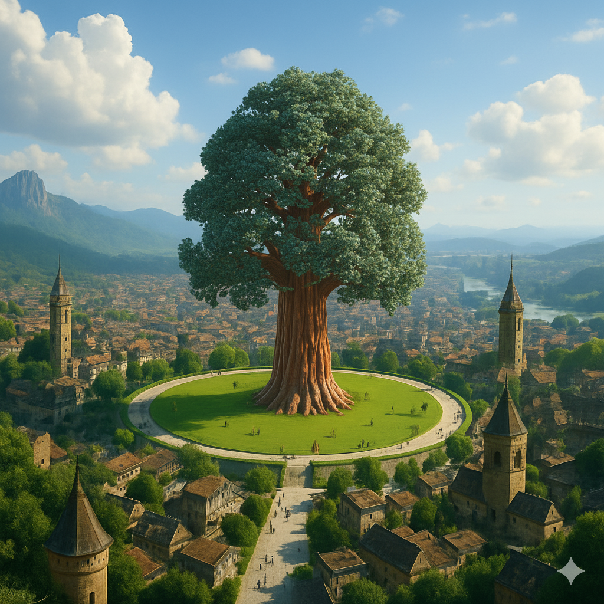

# Royaume de Tharvell  

**Type** : Royaume forestier.  

## Situation générale  
- Royaume situé aux abords des **Dents du Crépuscule**, sans mines d’ampleur, mais riche en ressources naturelles.  
- Deux richesses principales :  
  - **Pierres précieuses** issues du commerce avec les drakéides de Thuldrem.  
  - **Bois d’Igrodia**, conifère gigantesque atteignant jusqu’à **250 m de hauteur**, réputé pour sa solidité exceptionnelle.  

## Ressources et commerce  
- **Pierres précieuses** : revendues via les grands axes commerciaux.  
- **Bois d’Igrodia** :  
  - Très recherché pour la **construction navale** (notamment les chantiers de [Grimstad](../villes/grimstad.md)), mais aussi pour l’architecture monumentale.  
  - Transport complexe et coûteux, réservé aux clients les plus puissants.  
  - **Rituel de coupe** : avant d’abattre un arbre, les bûcherons doivent apporter **100 litres d’eau** puisée à la **source sacrée d’Ilagdir**, située à plus de 500 km au pied du glacier du même nom.  
  - Cette source est gardée par les **druides**, qui veillent au respect du rite.  

## Capitale — Skjorren  

- Ville construite **autour d’un vaste parc sacré** où pousse un Igrodia millénaire, nommé **Idingrodia**.  
- **Idingrodia** :  
  - Âge estimé : **1500 ans** (soit seulement un dixième de sa durée de vie).  
  - Hauteur actuelle : près de **100 m**.  
  - Protégé par un immense espace libre de toute construction pour ne pas fragiliser ses racines.  
- **Cérémonies druidiques** :  
  - Des druides venus de tout le sous-continent se réunissent périodiquement pour entrer en **symbiose** avec l’arbre.  
  - Ils le considèrent comme un être vivant sacré, centre spirituel du royaume.  
- **Légende d’Osgin** :  
  - On raconte que l’arbre aurait été planté par le druide **Osgin**.  
  - Selon les traditions orales, il vivrait encore **au cœur de l’arbre**, veillant sur Tharvell et ses habitants.  

## Pouvoir et société  
- Le royaume est gouverné par la noblesse, notamment la **famille Vilamidar**.  
- Toutefois, **aucune décision importante** ne peut être prise sans l’assentiment des **druides**, gardiens des forêts et des traditions.  
- Cet équilibre entre noblesse et druidisme façonne toute l’organisation du royaume.  

## Relations extérieures  
- **Khazal (à l’est)**, **Ternil** et **Siquimes (au nord)** respectent les traditions de Tharvell et ses rites druidiques.  
- **Valcalme (au nord)**, bien que respectueux en apparence, nourrit des **ambitions de mainmise sur les forêts d’Igrodia**.  
- Les échanges commerciaux renforcent la stabilité diplomatique, mais la richesse du bois reste convoitée.  

## Le sud de Tharvell  
- Région peu peuplée, soumise aux **glaces** et aux **attaques de dragons**.  
- On y trouve seulement quelques **villages de chasseurs et pêcheurs**, souvent isolés.  
- Ces communautés ne reconnaissent pas toujours l’autorité du nord, mais il n’existe **aucune querelle** à ce sujet.  

## Caractère du royaume  
- Pays de **forêts monumentales**, mystérieuses et imprégnées de magie druidique.  
- Réputation de **gardien de l’Igrodia**, fournisseur incontournable d’un bois légendaire.  
- Royaume respecté pour la valeur spirituelle et matérielle de son patrimoine naturel.  
