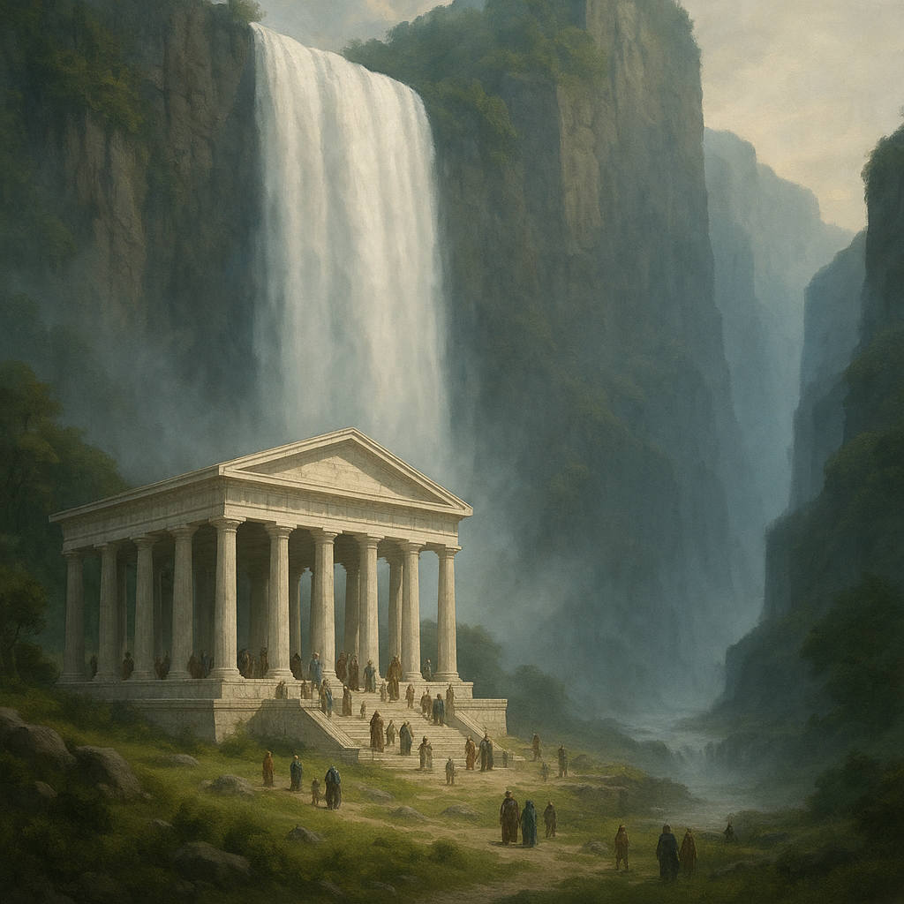

# Valcalme 
**Type :** Monarchie  

**Résumé**  
Valcalme est considéré comme le pays le plus prospère et le plus paisible de Ziven. Sa stabilité interne contraste avec une politique extérieure marquée par des ambitions expansionnistes, qui nourrissent des relations tendues avec ses voisins.  

## Géographie  
- Côtes tempérées ouvertes sur le commerce maritime.  
- Plaines fertiles le long de l’[Aldéra](../fleuves/aldera.md).  
- Le **Voile d’Aldéra**, cascade de près de 1000 m, lieu sacré pour les pèlerins.  
- À l’ouest, les **Collines Pourpres**, vignobles produisant les vins les plus réputés de Ziven.  
- À l’est, les **Falaises du Destin**, barrière naturelle et zone frontière.  
- Au sud de la ville de Fjarnest s’étend un **immense marais**, peuplé de crocodiles, basilics et autres créatures redoutables.  
- Au sud du royaume, **Tharvell**, dont les forêts d’**Igrodia** (conifères géants de 250 m) fournissent un bois exceptionnel pour la construction.  

## Culture  
- Noblesse marchande et raffinée.  
- Guildes puissantes, ancrées dans le commerce fluvial et maritime.  
- Tradition de droit écrit, de diplomatie et d’hospitalité.  
- Culte d’**Istus**, déesse du destin, au centre des pèlerinages annuels vers le temple d’Istus.  

## Points d’intérêt  

- **Hroldar** — Capitale située à l’embouchure de l’Aldéra.  
- **Temple d’Istus** (voir illustration) — Immense sanctuaire en marbre blanc, au pied du Voile d’Aldéra. Les colonnes maintiennent le toit mais le temple n'a pas de mur pour montrer que tous sont bienvenus.  
- **Draemir** — Ville frontière au pied des Falaises du Destin, point d’échanges et de tensions avec Edravorn et Khazal.  
- **Fjarnest** — Carrefour stratégique et cité-péage contrôlant le trafic fluvial et routier. C'est une ville-péage sur l’Aldéra, dernier point navigable du fleuve. De là part la route qui traverse la vallée de la Modoire, reliant Valcalme à [Siquimes](siquimes.md)

## Dynastie régnante  
La famille **Basmaret**, branche cadette issue de la maison **Siquimes**.  

## Relations extérieures  
- Relations **cordiales mais froides** avec le royaume de **Siquimes**, dont Valcalme est issu par sécession il y a trois siècles.  
- **Tensions vives** avec **[Khazal](khazal.md)** et les tribus d’**[Edravorn](edravorn.md)** depuis l’annexion de la haute vallée de l’Aldéra.  
- **Inquiétude** de **Tharvell**, qui craint l’appétit militaire de Valcalme pour ses forêts d’Igrodia.  
- **Relations privilégiées** avec la cité-état de **[Grimstad](grimstad.md)**, seule alliée véritable.  
