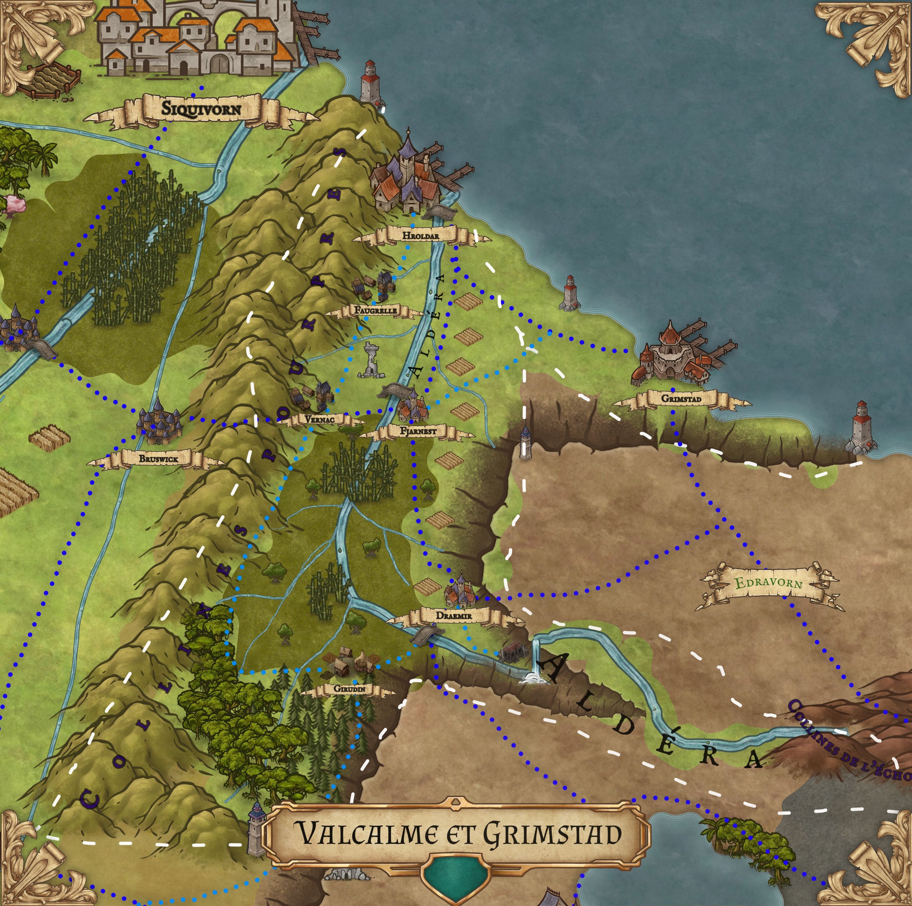

# Valcalme
**Type :** Monarchie

**Résumé**
Valcalme est considéré comme le pays le plus prospère et le plus paisible de Ziven. Sa stabilité interne contraste avec une politique extérieure marquée par des ambitions expansionnistes, qui nourrissent des relations tendues avec ses voisins.

## Géographie

Le royaume possède des côtes tempérées ouvertes sur le commerce maritime et des plaines fertiles le long de l'[Aldéra](../fleuves/aldera.md). Le **Voile d'Aldéra**, cascade de près de 1000 m, est un lieu sacré pour les pèlerins. À l'ouest s'étendent les **Collines Pourpres**, vignobles produisant les vins les plus réputés de Ziven. À l'est se dressent les **Falaises du Destin**, barrière naturelle et zone frontière. Au sud de la ville de Fjarnest s'étend un **immense marais**, peuplé de crocodiles, basilics et autres créatures redoutables. Au sud du royaume se trouve **[Tharvell](tharvell.md)**, dont les forêts d'**Igrodia** (conifères géants de 250 m) fournissent un bois exceptionnel pour la construction.

## Culture

La noblesse est marchande et raffinée. Les guildes sont puissantes, ancrées dans le commerce fluvial et maritime. Le royaume est marqué par une tradition de droit écrit, de diplomatie et d'hospitalité. Le culte d'**Istus**, déesse du destin, est au centre des pèlerinages annuels vers le temple d'Istus.

## Points d'intérêt

**Hroldar** est la capitale, située à l'embouchure de l'Aldéra. Le **temple d'Istus** (voir illustration) est un immense sanctuaire en marbre blanc, au pied du Voile d'Aldéra. Les colonnes maintiennent le toit mais le temple n'a pas de mur pour montrer que tous sont bienvenus. **Draemir** est une ville frontière au pied des Falaises du Destin, point d'échanges et de tensions avec Edravorn et Khazal. **Fjarnest** est un carrefour stratégique et une cité-péage contrôlant le trafic fluvial et routier. C'est une ville-péage sur l'Aldéra, dernier point navigable du fleuve. De là part la route qui traverse la vallée de la Modoire, reliant Valcalme à [Siquimes](siquimes.md).

## Dynastie régnante
La famille **Basmaret**, branche cadette issue de la maison **Siquimes**.

## Relations extérieures

Les relations avec le royaume de **Siquimes** sont **cordiales mais froides**, Valcalme en étant issu par sécession il y a trois siècles. Des **tensions vives** persistent avec **[Khazal](khazal.md)** et les tribus d'**[Edravorn](edravorn.md)** depuis l'annexion de la haute vallée de l'Aldéra. **Tharvell** nourrit une **inquiétude** face à l'appétit militaire de Valcalme pour ses forêts d'Igrodia. Les **relations privilégiées** avec la cité-état de **[Grimstad](grimstad.md)** en font la seule alliée véritable du royaume.
