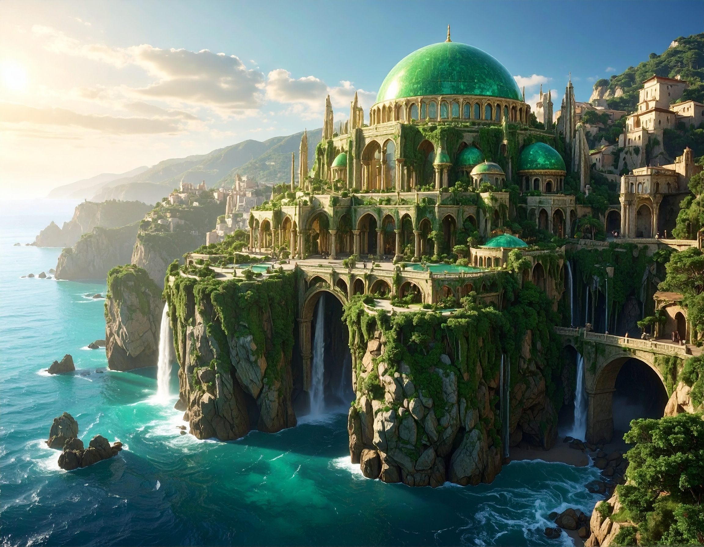

# Région de Vaultclos

## Géographie générale
- Située au pied des **Dents du Crépuscule**, s’étendant de l’océan au nord jusqu’au territoire de la cité-état de **Ternil** au sud.  
- Contraste marqué entre la côte fertile, les forêts humides et le **Massif du Nord**, riche en minerais.  

---

## Capitale et villes majeures
- **[Verdantis](../villes/verdantis.md)** — Capitale, la *Cité d’Émeraude*, bâtie en pierres vertes, réputée pour son éclat minéral et ses palais.  
- **Brennar** — Cité ouvrière et minière du **[Massif du Nord](../regions/massif_du_nord.md)**, connue pour la qualité exceptionnelle de son fer, recherché par forgerons et armuriers.  
- **Galordis** — Ville importante de la grande plaine centrale, carrefour entre Vaultclos et les régions de l’intérieur.  

---

## Régions naturelles
- **Plaine côtière du nord**  
  - Sol fertile grâce à l’influence océanique.  
  - Culture de fruits et légumes exigeant chaleur et humidité.  
  - Climat doux : hivers tempérés, étés modérés.  

- **Forêt de Morness** (au sud de Verdantis)  
  - Forêt humide et légèrement marécageuse.  
  - Abritant une faune dense et parfois dangereuse pour les imprudents.  
  - Surnommée *la forêt des larmes* à cause de la rosée qui goutte des arbres comme des pleurs.  

- **Massif du Nord**  
  - Chaîne de collines peu élevée mais riche en minerais, surtout en fer.  
  - Les habitants n’ont pas trouvé mieux que ce nom très simple, preuve de leur pragmatisme.  
  - Centre industriel : Brennar, cité minière.  

- **Forêt de Valdombre** (à l’ouest, vers Galordis)  
  - Dense et ancienne, considérée comme une frontière naturelle entre la côte et la plaine centrale.  
  - Sur les routes officielles, le passage est sûr, mais hors des sentiers se trouvent loups noirs et bandits.  
  - Lieu de légendes autour de menhirs engloutis par la végétation.  

---

## Ressources et enjeux
- **Fer du Massif du Nord** : réputé pour sa solidité, commerce florissant avec les royaumes voisins.  
- **Pierre verte de Verdantis** : convoitée pour l’architecture et la magie.  
- **Routes forestières** : passage obligé vers Ternil et la plaine centrale, souvent sujet à brigandage.  
- **Carrières abyssales de Verdantis**
    - Grottes sous-marines accessibles par des tunnels depuis la cité.  
    - Habitées et exploitées par des **Kuo-Toa** sous contrat ancestral.  
    - Rumeur persistante : ils extraient la pierre non pas pour les humains, mais pour un **“Dieu-poisson”** endormi dans les profondeurs. 

---

**Devise régionale (populaire)** :  
*"Le fer, la pierre et la mer."*

## Gallerie

  

