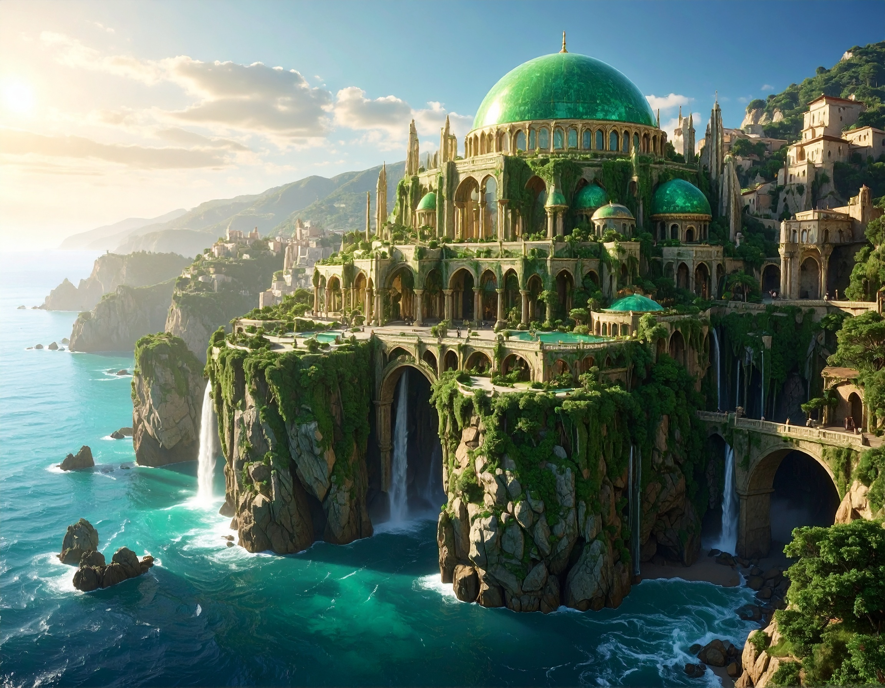

# Région de Vaultclos

## Géographie générale

Vaultclos est située au pied des **Dents du Crépuscule**, s'étendant de l'océan au nord jusqu'au territoire de la cité-état de **Ternil** au sud. La région présente un contraste marqué entre la côte fertile, les forêts humides et le **Massif du Nord**, riche en minerais.

---

## Capitale et villes majeures

**[Verdantis](../villes/verdantis.md)** est la capitale, surnommée la *Cité d'Émeraude*, bâtie en pierres vertes, réputée pour son éclat minéral et ses palais. **Brennar** est la cité ouvrière et minière du **[Massif du Nord](../regions/massif_du_nord.md)**, connue pour la qualité exceptionnelle de son fer, recherché par forgerons et armuriers. **Galordis** est une ville importante de la grande plaine centrale, carrefour entre Vaultclos et les régions de l'intérieur.

---

## Régions naturelles
### Plaine côtière du nord

Le sol est fertile grâce à l'influence océanique, propice à la culture de fruits et légumes exigeant chaleur et humidité. Le climat y est doux, avec des hivers tempérés et des étés modérés.

### Forêt de Morness (au sud de Verdantis)

C'est une forêt humide et légèrement marécageuse, abritant une faune dense et parfois dangereuse pour les imprudents. Elle est surnommée *la forêt des larmes* à cause de la rosée qui goutte des arbres comme des pleurs.

### Massif du Nord

Le Massif du Nord est une chaîne de collines peu élevée mais riche en minerais, surtout en fer. Les habitants n'ont pas trouvé mieux que ce nom très simple, preuve de leur pragmatisme. Brennar, cité minière, en est le centre industriel.

### Forêt de Valdombre (à l'ouest, vers Galordis)

Dense et ancienne, cette forêt est considérée comme une frontière naturelle entre la côte et la plaine centrale. Sur les routes officielles, le passage est sûr, mais hors des sentiers se trouvent loups noirs et bandits. Le lieu est riche en légendes autour de menhirs engloutis par la végétation.

---

## Ressources et enjeux

Le **fer du Massif du Nord** est réputé pour sa solidité, alimentant un commerce florissant avec les royaumes voisins. La **pierre verte de Verdantis** est convoitée pour l'architecture et la magie. Les **routes forestières**, passage obligé vers Ternil et la plaine centrale, sont souvent sujettes au brigandage. Les **carrières abyssales de Verdantis** sont des grottes sous-marines accessibles par des tunnels depuis la cité, habitées et exploitées par des **Kuo-Toa** sous contrat ancestral. Une rumeur persistante affirme qu'ils extraient la pierre non pas pour les humains, mais pour un **"Dieu-poisson"** endormi dans les profondeurs.

---

**Devise régionale (populaire)** :
*"Le fer, la pierre et la mer."*

## Gallerie

  

