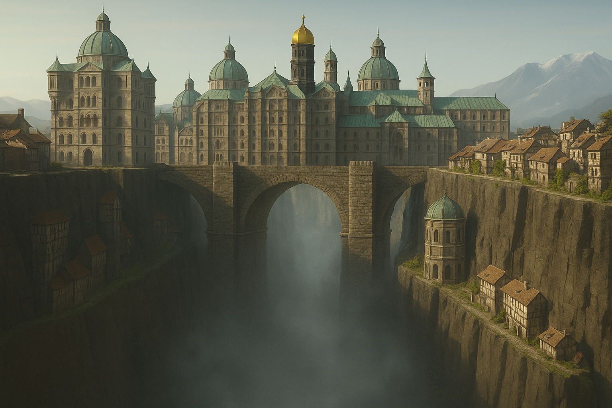

# Arkhazem, la Ville-Pont

## **1. Situation et fondements**
- **Type** : Capitale du [Royaume de Skjoldyr](../royaumes/skjoldyr.md)  
- **Localisation** : Enjambant le canyon de l’[Imgodir](../fleuves/imgodir.md), à plus de 1000 m de hauteur.  
- **Particularité** : Construite sur une arche monumentale longue de **10 km**, au point le plus étroit du canyon.  

## **2. Construction et matériaux**
- Une immense partie de la pierre provient des **[Collines de l’Écho](../regions/collines_de_lecho.md)**, dont plusieurs ont disparu suite aux extractions.  
- L’arche semble défier les lois de la physique, un **chef-d’œuvre autant magique qu’architectural**.  
- Les **tours élancées** et les **remparts massifs** bordent l’artère centrale, parcourue jour et nuit par les chariots.  

## **3. Vie urbaine et académique**
- **Écoles majeures** :  
  - École de magie (référence sur tout le sous-continent).  
  - École d’architecture (haut lieu de créativité, concurrente de Siquivorn).  
- **École de musique** de la Grande Guilde des Bardes, renforçant l’aura académique de la ville.  
- Les écoles sont installées dans de vastes **jardins suspendus**, oasis de verdure au-dessus du vide.  

## **4. Ressources et infrastructures**
- **Eau** : acheminée par un **aqueduc** depuis un glacier situé à 40 km.  
- **Transport** : l’artère centrale relie les quartiers et sert de marché permanent.  

## **5. Commerce magique**
- Arkhazem abrite un vaste réseau **d’échoppes d’objets magiques**, où se côtoient merveilles authentiques et artefacts douteux.  
- Le commerce est **taxé et contrôlé** par la **Guilde des Artisans Magiques**, qui en détient le monopole.  
- **Siège de la Guilde** : un édifice monumental en **pierre noire des collines de Négovar**, véritable forteresse au cœur de la ville.  
- La guilde entretient sa **propre milice**, garante de l’ordre et du respect des taxes.  
- Elle perçoit également des **taxes d’entrée et de sortie** de la ville, ce qui en fait l’un des pouvoirs financiers les plus redoutés du royaume.  
- Les enchères publiques d’objets rares attirent marchands, nobles et aventuriers de tout le sous-continent.  

## **6. Particularités sociales**
- Chaque année, des **étudiants alcoolisés tombent du pont**, malgré les hautes murailles de protection.  
- Lieu d’intense effervescence intellectuelle et artistique, la ville attire les plus grands talents du monde connu.  

## **7. Position politique**
- Arkhazem est à la fois :  
  - **Capitale politique et magique** du [Royaume de Skjoldyr](../royaumes/skjoldyr.md).  
  - Symbole de sa **suprématie culturelle et économique** face à la cité marchande de **Siquivorn**.  
