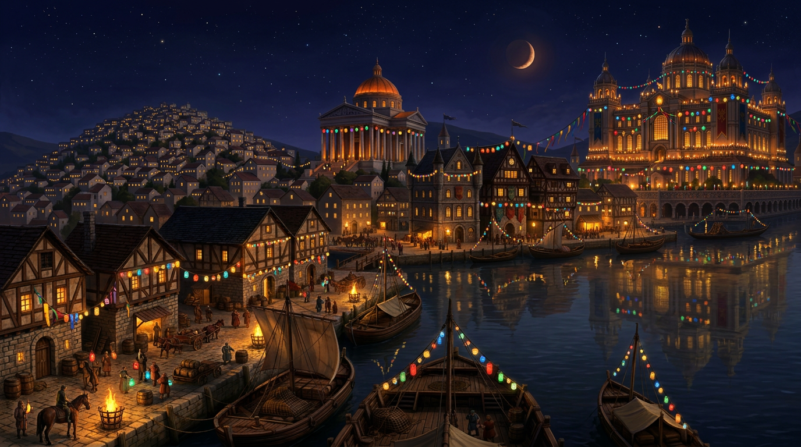
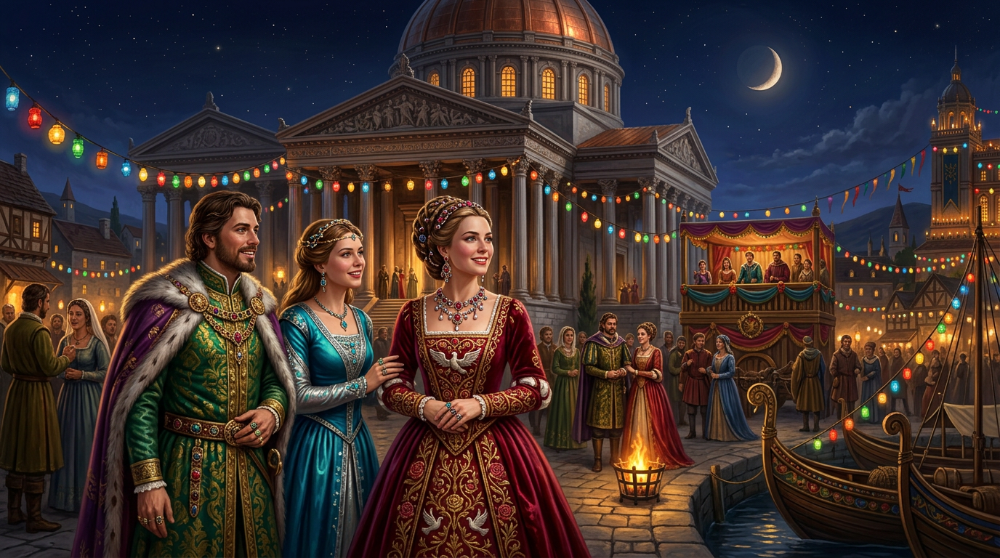

# Glounar – La Ville du Luxe et du Fleuve

**Résumé :** Deuxième ville de Ziven par sa taille, Glounar est située au point où l'Imrisse cesse d'être navigable.
Carrefour commercial incontournable, elle est aussi une capitale du raffinement et de l'élégance, connue dans tout le
sous-continent pour ses parfums, ses bijoux horaires et ses tailleurs. Derrière le vernis du festival de Sunie et
l'éclat de ses guildes, la ville cache des inégalités profondes et une société aussi cruelle que ses façades sont
belles.

## Situation et fondements

**Type** : Ville ducale, carrefour fluvial et capital du luxe artisanal

**Localisation** : Point de rupture de charge de l'Imrisse, limite du contrôle direct de la famille Siquimes

**Gouvernance** : Duc issu de la fratrie impériale, nommé à vie

## Géographie et urbanisme

Glounar s'étend sur la rive sud de l'Imrisse, organisée autour d'une colline de faible hauteur qui structure toute la
vie sociale de la ville.

Le versant nord de la colline, tourné vers le fleuve, concentre le pouvoir et la richesse. Le versant sud marque le
début des quartiers populaires et pauvres, relégués hors de vue des visiteurs de marque.

## Le palais ducal et les quais

L'ancienne forteresse qui gardait le point de rupture du fleuve a été intégralement rénovée il y a cinq cents ans par
Aldémar Siquimes. Ce n'est pas une transformation accidentelle mais un acte politique délibéré : la famille impériale a
mis en scène sa propre puissance dans la pierre. Le duc actuel vit dans un cadre que sa lignée n'a pas construit.

Les quais s'étendent au pied du palais. C'est là que les marchands ont leurs bureaux, proches du pouvoir ducal et du
flux des marchandises qui transitent entre le fleuve et les routes terrestres. Les guildes artisanales sont également
installées à proximité du palais, dans son ombre protectrice.

## La rupture de charge

Glounar vit du fait que les marchandises remontant l'Imrisse doivent y être transbordées sur des chariots. Tout ce qui
circule entre Siquivorn et l'ouest du sous-continent passe par ses quais. Cette position génère une richesse
considérable et une classe marchande puissante, organisée en contrats exclusifs avec les familles artisanales.

## L'organisation des guildes et des familles

Le tissu artisanal de Glounar repose sur deux niveaux imbriqués.

Les **familles** détiennent et transmettent les savoir-faire. À l'intérieur d'une même discipline, elles se livrent une
concurrence feutrée mais impitoyable : secrets jalousement gardés, mariages stratégiques, apprentis soufflés à la
concurrence. Chaque famille produit ses propres créations comme autant de déclarations adressées à ses rivales.

Les **guildes** rassemblent les familles d'un même métier. Elles existent pour régler les conflits internes et présenter
un front uni vers l'extérieur. Les rivalités ne s'effacent pas à l'intérieur, mais face au reste de Ziven, les guildes
oublient leurs différends pour asseoir leur domination collective.

Les principales guildes sont celles des parfumeurs, des horlogers, des tailleurs et des bijoutiers. Chaque marchand
tient ses contrats d'une seule famille par discipline. Vendre deux types de parfums différents, c'est être banni par
toutes les familles et toutes les guildes simultanément. La loyauté est imposée par la menace collective.

### Les bijoux horaires

La spécialité la plus renommée de Glounar. Ces pièces d'une précision extraordinaire indiquent l'heure par des
mécanismes savants, transmis de maître à apprenti dans le secret absolu. Leur valeur repose précisément sur leur rareté
technique : aucun mage ne peut les reproduire, ce qui les rend d'autant plus prestigieux aux yeux des grandes cours de
Ziven. Porter un bijou horaire de Glounar, c'est afficher quelque chose que l'argent seul ne suffit pas à obtenir. Les
familles d'horlogers sont parmi les plus fermées de la ville, capables de refuser une commande même à un noble.

## La colline des artisans

Le quartier des parfumeurs, celui des horlogers et celui des tailleurs occupent la colline qui domine le sud du fleuve.
Chaque quartier a son caractère propre.

Les parfumeurs travaillent dans des ruelles où les odeurs se superposent et s'affrontent, chaque atelier diffusant ses
essences comme une déclaration de territoire.

Les horlogers sont discrets, fenêtres souvent condamnées, portes épaisses, le bruit des mécanismes soigneusement
étouffé.

Les tailleurs occupent les rues les plus colorées, les étoffes débordant des façades, chaque famille affichant ses
dernières créations.

Les bijoutiers occupent les places les plus proches du temple de Sunie. Cependant, leurs échoppes sont barricadées pour
quiconque ne saurait montrer pate blanche. Dans le cas des bijoutiers de Glounar, une pate blanche est une bourse bien
remplie.

## Le quartier du temple

Le temple de Sunie, déesse de l'amour et de la beauté, est l'un des plus grands édifices de Ziven. Il attire des
pèlerins fortunés, des artistes et des courtisans venus de tout le sous-continent.

Le quartier qui l'entoure est la façade dorée de la ville. De jour, les nobles s'y promènent et les salons privés
reçoivent une clientèle choisie. À la tombée de la nuit, le vernis craque : les auberges aux mœurs souples font leurs
meilleures affaires, les tavernes grouillent de monde et les vraies négociations commerciales se tiennent loin des
bureaux officiels.

## Le festival de Sunie

Événement annuel majeur, le festival de Sunie est à la fois pèlerinage, semaine commerciale et démonstration de
puissance sociale. Les grandes maisons de Ziven y viennent pour commander, exhiber et se montrer. Un bijou horaire au
poignet ou un parfum exclusif sont les signes ultimes du statut.

Pendant le festival, la frontière sociale de la colline devient officielle. Les habitants qui ne portent pas d'habits
suffisamment raffinés ne peuvent pas passer au nord de la colline. Les dockers qui font vivre la ville au quotidien
travaillent de nuit pour décharger les marchandises, le vin de Valcalme et les matières premières qui arrivent par le
fleuve, afin que le spectacle reste immaculé le jour.

Le temple lui-même joue un rôle d'arbitre informel entre les guildes, commandant aux unes et aux autres pour ses
cérémonies. La faveur des prêtres de Sunie vaut de l'or.

## Le quartier pauvre

Au sud de la colline des artisans commence un monde que le festival s'emploie à rendre invisible. La richesse artisanale
de Glounar repose sur du travail que la ville préfère ne pas montrer à ses visiteurs de marque.

## La succession ducale

Le duché de Glounar est tenu par un membre de la fratrie impériale, nommé à vie. À sa mort, c'est le frère ou la sœur de
l'Empereur régnant qui lui succède, pas ses propres descendants. Quelque part à Siquivorn, l'héritier potentiel attend.
Les guildes et les marchands de Glounar cultivent discrètement leurs relations avec cette personne, sachant que la
transition peut survenir à tout moment.