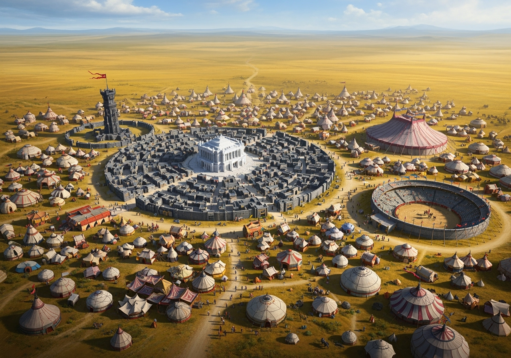

# Khareb – Carrefour des Steppes  

**Résumé :** Ville-étape des caravanes, Khareb est surtout connue pour ses marchés d’épices, sa **course annuelle des steppes**, son **immense cirque permanent** et sa silhouette unique : un noyau de pierre ceinturé de murailles-parevents, entouré d’un océan de tentes et de yourtes.  

## Origines et rôle stratégique  
À l’origine, Khareb n’était qu’un campement dressé autour d’un des rares points d’eau de la route reliant [Arkhazem](../villes/arkhazem.md), capitale magique de [Skjoldyr](../royaumes/skjoldyr.md), à l’Ouest du sous-continent.  
- Les denrées alimentaires et minières de l’Ouest y transitaient, en échange des artefacts magiques issus des ateliers d’Arkhazem.  
- Les pistes caravanières convergent toutes vers Khareb, qui s’imposa rapidement comme carrefour incontournable des steppes.  

## Une ville de passage  
Khareb reste davantage un lieu de passage qu’une véritable cité dense :  
- Le centre est construit en pierre, dominé par la **guilde des cavaliers**, un édifice prestigieux bâti en marbre blanc de [Rochevent](../villes/rochevent.md).  
- Ce noyau est protégé par de **murailles basses en pierre sombre**, conçues comme des **pare-vents** contre les tempêtes de sable. Elles ne peuvent pas être closes : leurs larges ouvertures laissent passer l’air et les caravanes.  
- La majeure partie de la ville s’étend au-delà de ce cercle : un **océan de tentes et de yourtes colorées**, habitées par marchands, artisans et tribus de passage.  
- Les tribus d’[Edravorn](../royaumes/edravorn.md) y viennent écouler leurs marchandises : peaux tannées, cuirs souples, arcs courts et objets utilitaires forgés dans les hauts plateaux.  
- Le marché aux épices reste l’un des plus réputés de la steppe : cannelle, safran, poivre et produits ultramarins y transitent, échangés contre des pierres précieuses ou du bétail.  

## La course annuelle des steppes  
Événement phare de Khareb, la **course annuelle des steppes** est une épreuve de 200 km en trois jours, mettant à rude épreuve montures et cavaliers.  
- Les spectateurs affluent alors, notamment les nobles et érudits d’Arkhazem, fascinés par ces compétitions extrêmes.  
- Les concurrents viennent de tout le sous-continent, voire au-delà, donnant à l’événement un parfum cosmopolite.  
- La récompense : 5000 pièces d’or, auxquelles la **guilde des artisans magiques** ajoute un artefact unique, toujours lié à la cavalerie (selle enchantée, bride augmentant l’endurance, talisman de communication avec sa monture, etc.).  

## Culture et ambiance  
- Les arènes d’adresse équestre sont fréquentées toute l’année : tir à l’arc monté, voltige, jeux de vitesse.  
- Un **immense cirque permanent** accueille spectacles, compétitions et représentations diverses. C’est un lieu vivant, toujours animé, qui attire autant les habitants que les voyageurs.  
- La ville garde une atmosphère de halte caravanière : tavernes bondées, ruelles poussiéreuses, senteurs d’épices et de cuir.  
- L’hospitalité est codifiée : un voyageur est sacré tant qu’il demeure sous l’auvent d’un hôte, mais les conflits tribaux ressurgissent parfois dans les rues.  
- Les habitants se voient comme les gardiens du passage : ni tout à fait citadins, ni tout à fait nomades.  
- La **guilde des cavaliers**, richement décorée de fresques, tapis et sculptures, n’ouvre ses portes qu’aux élites équestres ou aux riches visiteurs attirés par la renommée des courses.  

## Particularités  
- Les sources d’eau de Khareb sont soigneusement entretenues, protégées comme un trésor vital.  
- La ville ne possède pas de murailles closes : seules les **murailles-parevents** entourant le centre de pierre assurent une protection partielle contre les vents et les tempêtes de sable.  
- À l’écart s’élève la **Flèche des Steppes**, une haute tour de guet en pierre sombre, servant à surveiller l’horizon par temps clair et à suivre le nuage des chevaux lors de la course annuelle.  
- Une vaste **arène circulaire en pierre** complète le paysage, dédiée aux courses et aux compétitions équestres.  
