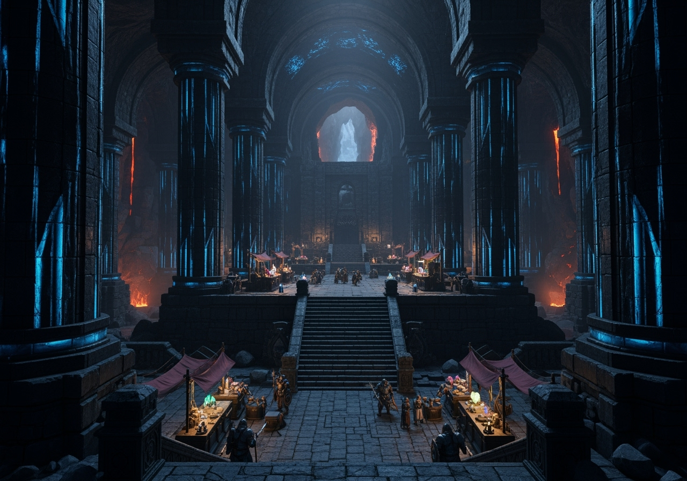

# Khazrund – La Cité-Mine des Nains

**Résumé :** Ville-mine naine creusée dans un volcan des [dents du crépuscule](../regions/dents_du_crepuscule.md), réputée pour ses richesses, son marché colossal et ses défenses impénétrables.

## Les Portes de Feu

L’entrée de Khazrund est marquée par deux **colonnes titanesques** de roche volcanique noire.  
Même un **dragon vénérable** pourrait y entrer, mais quiconque franchit le seuil se retrouve sous la menace constante des **balistes automatiques** et des **pièges mécaniques** actionnables d’un simple geste des gardes nains.

À droite de l’entrée se trouve le **vestiaire des armes** : tout visiteur non-nain doit y déposer son attirail sous peine de se voir refuser l’accès.

## La Grande Salle et son marché
Le cœur de Khazrund est une **caverne monumentale** dont les parois et les arches s’élancent si haut qu’elles se perdent dans l’ombre. Des **colonnes de basalte noir**, striées de **veines de luminite bleutée**, soutiennent la voûte et diffusent une clarté mystique dans toute la salle.

Au centre, une **vaste plateforme de pierre** domine l’espace, accessible par de larges escaliers et surveillée par des nains en armes. C’est là que se concluent les **échanges des matériaux les plus précieux** : gemmes étincelantes, lingots de mithril, armes forgées et artefacts mystérieux.

Autour de la plateforme, des **échoppes couvertes de toiles** offrent pierres rares, minerais, objets d’artisanat et denrées importées. La chaleur des coulées de lave visibles plus loin se mêle à l’éclat bleu de la luminite, donnant au marché une ambiance à la fois solennelle et animée, où le commerce se fait sous l’œil vigilant des gardes et des prêtres nains.

## La Lumière des profondeurs

L’éclairage provient de la **luminite** : une roche qui s’illumine au contact de la vapeur.

Les **ingénieurs nains** ont conçu un réseau unique :
- Une source alimente la cité en eau potable.
- Cette eau est chauffée par les rivières de lave, produisant la vapeur nécessaire pour activer la luminite.

Résultat : une lumière stable, chaude, diffuse, qui rend la cité aussi claire qu’en plein jour.

## Défenses contre la magie
Khazrund ne craint pas seulement les armes, mais aussi les arcanes.

Un **forgeron-mage nain** de renommée internationale y fabrique les célèbres **armures de dispersion de magie** :
- Prix : **50 000 pièces d’or**, sans le mithril nécessaire à leur forge.
- Une remise peut être négociée par les membres de la **Guilde des artisans magiques d’Arkhazem**.

Plusieurs **prêtres-nains** veillent en permanence, imposant un **silence magique** dans les zones ouvertes aux visiteurs.

Enfin, quiconque oserait piller les richesses de Khazrund serait **maudit et proscrit** sur tout le sous-continent : trop de royaumes dépendent du flux de richesses qui sort de ces mines pour tolérer une telle offense.

## La cité interdite

Peu de voyageurs ont franchi le **grand pont de pierre** qui enjambe la rivière de lave menant aux quartiers nains.

L’hospitalité s’arrête aux dizaines d’**auberges de la Grande Salle**.

Mais des rumeurs persistent :
- **Salle du trône** pavée d’or et de luminite, sertie de gemmes.
- **Grande place souterraine** avec un **jardin artificiel**, alimenté par la chaleur contrôlée de la lave et l’éclairage des pierres lumineuses.
- Des milliers de maisons creusées en alvéoles le long des parois volcaniques.

## Puissance et population
Selon les récits d’explorateurs, Khazrund compterait près de **cinq mille nains**, faisant d’elle l’une des plus grandes cités de Ziven.

Le roi tire ses richesses des taxes sur le marché et de la prospérité minière, ce qui lui permet d’entretenir une **armée puissante** qui n’est pas employée qu’à la défense…  
