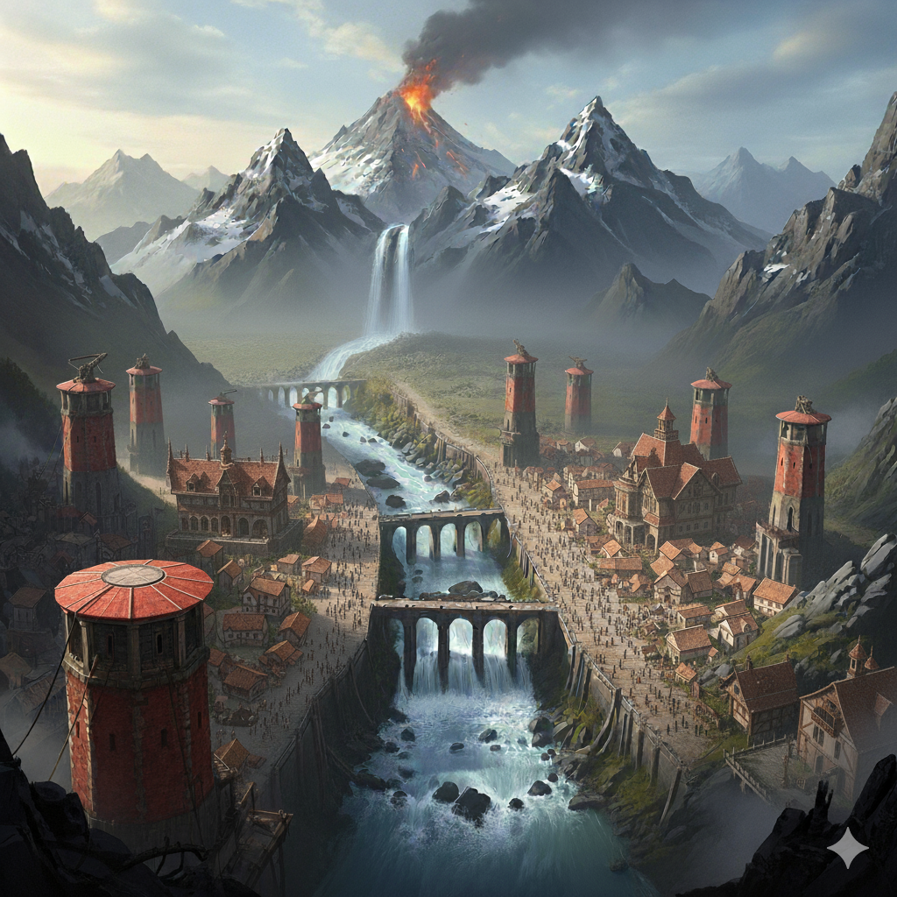

# Morh-Khaz

Ville d’origine d’**Eivan**, barbare drakéïde.  
Située au pied des **Dents du Crépuscule**, chaîne de montagnes infranchissable qui borde l’ouest de Ziven. La ville est traversée par l’**Imrisse**, grand fleuve qui draine une grande partie de l’ouest du sous-continent.

## Population
- Environ **2000 habitants**.  
- **Majorité** : drakéïdes.  
- **Présents** : humains, quelques nains, quelques demi-orcs (défense contre les dragons blancs).  
- **Absents** : elfes, gnomes, halfelins, tieffelins.  

## Économie
- Commerce des **métaux et pierres** venant de la **mine-ville naine de Khazrund** (à une petite semaine de marche).  
- Est : terres **fertiles**.  
- Ouest : terres **brûlées** par les éruptions volcaniques.  

## Politique & Société
- **Rattachement** : cité-état de **Ternil**, mais gestion relativement **autonome**.  
- **Dirigeant** : **Rungard de la dynastie Sangdragon**, duc drakéïde, respecté et haï à la fois. Gouvernance pragmatique et dure, adaptée aux menaces (raids, éruptions).  
- **Sa fille, Zaryss** : réputée pour sa grande beauté (selon les critères drakéïdes), mais jugée totalement **inaccessible**.  

## Architecture & Défense
- **Pas d’enceinte** : les murailles sont inutiles contre les dragons.  
- **Vingt tours rouges** :  
  - Chacune équipée d’**immenses balistes** capables de repousser (ou d’abattre) les dragons blancs.  
  - Construites en **ryolite rouge**.  
  - Héritage d’une découverte vieille de **huit siècles** : les dragons blancs des Dents du Crépuscule distinguent mal le rouge.  
  - Après un raid destructeur, les quatre tours abattues furent reconstruites en pierre rouge. Depuis, toutes les nouvelles tours suivent ce schéma.  
  - Les **gardes de la ville** portent aussi des **uniformes rouges**, en écho à cette stratégie défensive.  
- **Butins draconiques** : une ou deux fois par décennie, un dragon est tué. La richesse de son cadavre (écailles, os, sang, magie résiduelle) attire la convoitise des nobles et puissants de tout le continent.  
- **Sous-sols** : caves et réseaux souterrains servant de refuges en cas de raid ou d’éruption.  
