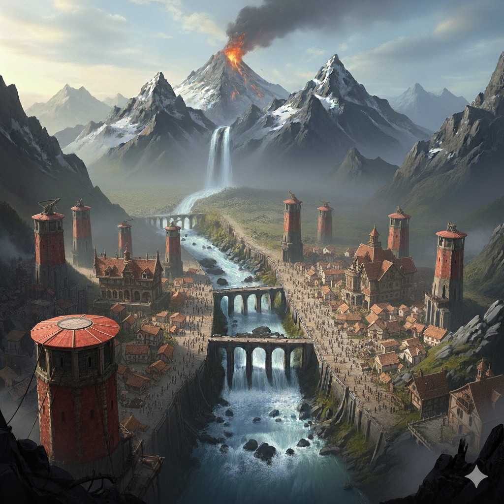

# Morh-Khaz

Située au pied des **Dents du Crépuscule**, chaîne de montagnes infranchissable qui borde l'ouest de Ziven. La ville est traversée par l'**Imrisse**, grand fleuve qui draine une grande partie de l'ouest du sous-continent.

## Population

Morh-Khaz compte environ **2000 habitants**. La **majorité** est composée de drakéïdes. On y trouve également des humains, quelques nains et quelques demi-orcs qui participent à la défense contre les dragons blancs. En revanche, les elfes, gnomes, halfelins et tieffelins sont absents de la ville.

## Économie

L'économie repose principalement sur le commerce des **métaux et pierres** venant de la **mine-ville naine de Khazrund**, située à une petite semaine de marche. À l'est s'étendent des terres **fertiles**, tandis qu'à l'ouest les terres sont **brûlées** par les éruptions volcaniques.

## Politique & Société

La ville est rattachée à la cité-état de **Ternil**, mais jouit d'une gestion relativement **autonome**. Elle est dirigée par **Rungard de la dynastie Sangdragon**, duc drakéïde, respecté et haï à la fois, dont la gouvernance pragmatique et dure est adaptée aux menaces constantes que représentent les raids et les éruptions. **Sa fille, Zaryss**, est réputée pour sa grande beauté (selon les critères drakéïdes), mais jugée totalement **inaccessible**.

## Architecture & Défense

Morh-Khaz ne possède **pas d'enceinte**, les murailles étant inutiles contre les dragons. La ville est défendue par **vingt tours rouges**, chacune équipée d'**immenses balistes** capables de repousser ou d'abattre les dragons blancs. Ces tours sont construites en **ryolite rouge**, un choix hérité d'une découverte vieille de **huit siècles** : les dragons blancs des Dents du Crépuscule distinguent mal le rouge. Après un raid destructeur, les quatre tours abattues furent reconstruites en pierre rouge, et depuis, toutes les nouvelles tours suivent ce schéma. Les **gardes de la ville** portent aussi des **uniformes rouges**, en écho à cette stratégie défensive.

Une ou deux fois par décennie, un dragon est tué. La richesse de son cadavre (écailles, os, sang, magie résiduelle) attire la convoitise des nobles et puissants de tout le continent, constituant de précieux **butins draconiques**. Enfin, des **sous-sols** composés de caves et de réseaux souterrains servent de refuges en cas de raid ou d'éruption.

## L'offrande aux dragons

En Ondié, le duc Rungard Sangdragon conduit une cérémonie ancienne et solennelle, bien antérieure aux tours rouges qui défendent la ville. L'offrande n'attire guère les foules extérieures et les rares étrangers qui y assistent en parlent avec un mélange de fascination et d'inconfort. C'est un rite de coexistence avec les dragons des [Dents du Crépuscule](../regions/dents_du_crepuscule.md), rappelant que Morh-Khaz vit depuis toujours à leur ombre.
