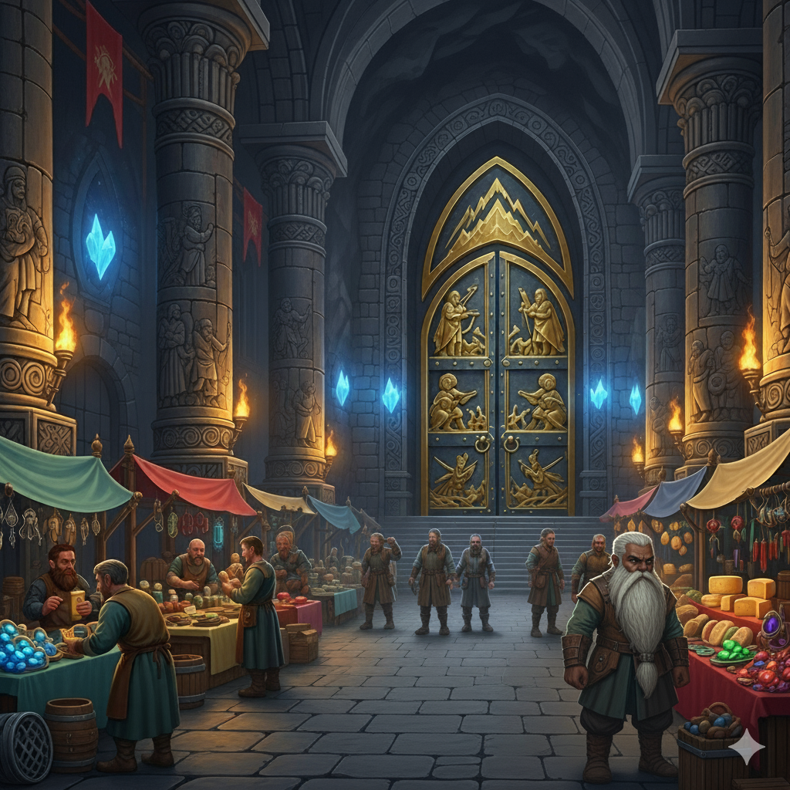

# Negovarund – La Mine-Ville sous le Volcan

**Type** : Mine-ville naine  
**Localisation** : Sous le volcan de Negovar, au sud glacé de Khazal  
**Population** : ~1 500 nains  
**Richesses principales** : **pyrothril**, verre volcanique, fromages affinés, artisanat de forge
**Gouvernance** : Conseil des Anciens, dirigé de manière tournante tous les six mois par un représentant de chaque grande famille.

## Origines et Histoire
Fondée pour exploiter les veines de **pyrothril**, Negovarund est restée une communauté discrète, isolée par le froid et les vents du sud de Khazal. Mais son volcan, loin de n’être qu’une menace, est devenu un allié : sa chaleur permet l’existence de cultures et de pâturages improbables dans un tel climat.  
Au fil des siècles, les habitants ont appris à exploiter ces ressources pour survivre et même prospérer.

## Ressources et Artisanat
- **Pyrothril** : métal rouge sombre, résistant naturellement au feu, forgé en armures très recherchées.
- **Adamantium** : rare, exporté brut.
- **Verre volcanique** : utilisé pour les serres agricoles et certaines décorations.
- **Fromage bleu de Negovarund** : affiné dans les caves volcaniques, à pâte persillée, réputé dans tout Ziven pour sa finesse et sa saveur unique. Ce produit d’exception permet aux nains d’acheter le fourrage nécessaire pour l’hiver.

## Structure de la Cité
- **Hall d’Entrée** : grande galerie commerçante et lieu de contact avec les marchands étrangers.
- **Forges** : spécialisées dans le travail du pyrothril, alimentées par les veines de chaleur du volcan.
- **Mines** : galeries profondes, extrayant pyrothril et gemmes.
- **Serres extérieures** : protégées par des murs, chauffées par des sources chaudes. Elles permettent de cultiver légumes, céréales et herbes.
- **Pâturages chauffés** : grâce aux canalisations d’eau chaude, certaines prairies sont exemptes de neige pendant près de six mois par an, assurant la subsistance des troupeaux.
- **Temple de la Flamme** : centre spirituel dédié à Moradin, dieu des nains et des forges.
- **Salle du Conseil** : centre politique où les Anciens se réunissent.
- **Caves d’affinage** : situées dans des affractuosités volcaniques, idéales pour le fromage.

## Vie et Culture
- **Fromages bleus** : fierté locale, affinés dans des caves à température stable et vendus à prix d’or dans les grandes villes.
- **Agriculture de survie** : cultures sous serres, champignons des cavernes, légumes de serre et élevage de chèvres et de brebis.
- **Brasseries** : bières sombres, brassées à partir de malt venu du lac Dorin. Le houblon est cultivé dans les serres.
- **Artisanat** : forgerons et tailleurs de pierre produisent des objets utilitaires et décoratifs, souvent ornés de motifs volcaniques.
- **Fêtes** : célébrations autour des cycles du volcan, avec danses, chants et festins.
- **Échanges** : le pyrothril et le fromage constituent les principales exportations.
- **Transhumance** : six à sept mois par an, les bergers sortent des grottes pour mener les troupeaux aux pâtures. Ils sont accompagnés par les agriculteurs qui cultivent les serres.

## Défenses
- **Balistes** sur les hauteurs, utilisées contre les dragons blancs qui rôdent dans les airs glacés.
- **Sentinelles** : mineurs-soldats habitués aux conditions extrêmes.
- Le climat et l’isolement restent les meilleurs remparts de Negovarund.  
