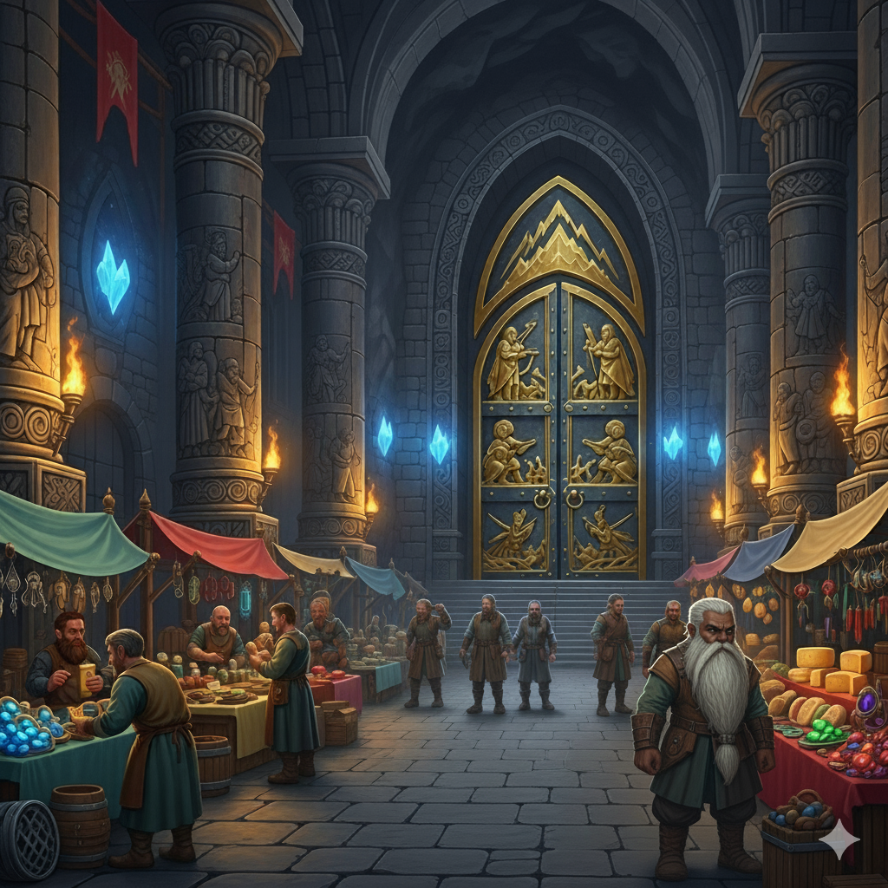

# Negovarund – La Mine-Ville sous le Volcan

**Type** : Mine-ville naine
**Localisation** : Sous le volcan de Negovar, au sud glacé de Khazal
**Population** : ~1 500 nains
**Richesses principales** : **pyrothril**, verre volcanique, fromages affinés, artisanat de forge
**Gouvernance** : Conseil des Anciens, dirigé de manière tournante tous les six mois par un représentant de chaque grande famille.

## Origines et Histoire
Fondée pour exploiter les veines de **pyrothril**, Negovarund est restée une communauté discrète, isolée par le froid et les vents du sud de Khazal. Mais son volcan, loin de n'être qu'une menace, est devenu un allié : sa chaleur permet l'existence de cultures et de pâturages improbables dans un tel climat.
Au fil des siècles, les habitants ont appris à exploiter ces ressources pour survivre et même prospérer.

## Ressources et Artisanat

Le **pyrothril** est un métal rouge sombre, résistant naturellement au feu, forgé en armures très recherchées. L'**adamantium**, rare, est exporté brut. Le **verre volcanique** est utilisé pour les serres agricoles et certaines décorations. Le **fromage bleu de Negovarund**, affiné dans les caves volcaniques, est un produit à pâte persillée réputé dans tout Ziven pour sa finesse et sa saveur unique ; ce produit d'exception permet aux nains d'acheter le fourrage nécessaire pour l'hiver.

## Structure de la Cité

Le **Hall d'Entrée** est une grande galerie commerçante qui sert de lieu de contact avec les marchands étrangers. Les **forges**, spécialisées dans le travail du pyrothril, sont alimentées par les veines de chaleur du volcan. Les **mines** s'enfoncent en galeries profondes, d'où l'on extrait pyrothril et gemmes. Les **serres extérieures**, protégées par des murs et chauffées par des sources chaudes, permettent de cultiver légumes, céréales et herbes. Les **pâturages chauffés**, grâce aux canalisations d'eau chaude, sont des prairies exemptes de neige pendant près de six mois par an, assurant la subsistance des troupeaux. Le **Temple de la Flamme** est le centre spirituel dédié à Moradin, dieu des nains et des forges. La **Salle du Conseil** est le centre politique où les Anciens se réunissent. Les **caves d'affinage**, situées dans des affractuosités volcaniques, offrent les conditions idéales pour le fromage.

## Vie et Culture

Les **fromages bleus** sont la fierté locale, affinés dans des caves à température stable et vendus à prix d'or dans les grandes villes. L'**agriculture de survie** repose sur des cultures sous serres, des champignons des cavernes, des légumes de serre et l'élevage de chèvres et de brebis. Les **brasseries** produisent des bières sombres, brassées à partir de malt venu du lac Dorin, le houblon étant cultivé dans les serres. L'**artisanat** des forgerons et tailleurs de pierre produit des objets utilitaires et décoratifs, souvent ornés de motifs volcaniques. Des **fêtes** ponctuent l'année, célébrations autour des cycles du volcan avec danses, chants et festins. Le pyrothril et le fromage constituent les principales exportations. La **transhumance** occupe six à sept mois par an : les bergers sortent des grottes pour mener les troupeaux aux pâtures, accompagnés par les agriculteurs qui cultivent les serres.

## Défenses

Des **balistes** sont installées sur les hauteurs, utilisées contre les dragons blancs qui rôdent dans les airs glacés. Les **sentinelles** sont des mineurs-soldats habitués aux conditions extrêmes. Le climat et l'isolement restent les meilleurs remparts de Negovarund.
