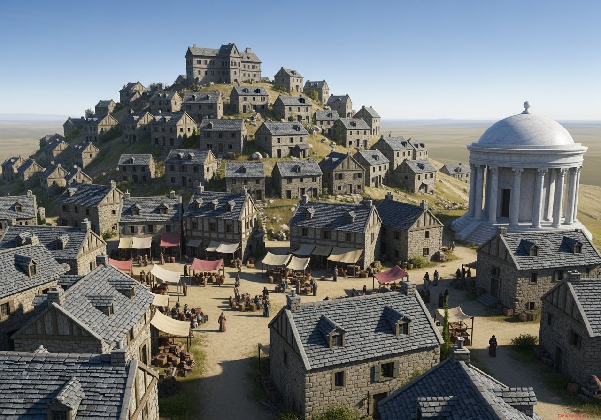

# Rochevent

Petit village du [royaume de Khazal](../royaumes/khazal.md) accroché aux pentes d’une colline qui surplombe le plateau d’Onalpita, **Rochevent** vit au rythme de sa carrière de marbre blanc, réputée dans tout Ziven. Situé à une quarantaine de kilomètres des **Collines de l’Écho**, le village est dominé par le **manoir d’Outremont**, résidence ancestrale de Lord Edgar.  

 

## Géographie et situation
- **Relief** : le village s’étage sur la colline, dominé par le manoir d’Outremont.  
- **Panorama** : vue sur l’immensité du [plateau d’Onalpita](../regions/onalpita.md), balayé par les vents. Au nord, on voit les collines de l'écho.
- **Proximité** : la carrière est à une quinzaine de minutes de marche, voisine d’un camp de bagnards.
- **Climat** : Peu de pluie à cause des collines qui bloquent totalement l'influence océanique. Il est exposé aux quatre vents mais le plus rude est le vent du sud qui apporte le froid.

## Population
Les Rocheventaux sont principalement des contremaîtres et des gardes. Quelques bucherons exploitent la forêt au pied des [collines de l'écho](../lieux/colline-echo.md). Hormis eux et quelques marchands, l'ensemble des habitants dépend de l'exploitation de la carrière de Marbre blanc.

## Ressources et activités
- **Carrière de marbre blanc** : exploitée depuis deux siècles, fournit une pierre renommée dans tout Ziven, utilisée pour palais, temples et mausolées. L'exportation se fait via [Khareb](khareb.md)
- **Camp de bagnards** : attenant à la carrière, source de main-d’œuvre forcée et de rumeurs persistantes.  
- **Agriculture** : limitée à des jardins pierreux, pauvres en rendements. Le commerce compense ce manque.  

## Lieux notables
- **Manoir d’Outremont** : résidence seigneuriale, symbole de la puissance locale.  
- **Temple d’Ulaa** : construit entièrement en marbre blanc, orné de colonnes richement décorées.  
- **Auberge** : halte pour voyageurs et marchands, centre de rumeurs locales. Quelques pélerins y restent quand ils viennent voir l'impressionnant temple qui se trouve dans le village.
- **Place centrale** : quelques échoppes vendent des produits alimentaires (pain, légumes secs, fromages, viandes salées). Il y a de temps à autre un colporteur.
- **Forge** : principalement dédiée au matériel d’extraction du marbre, peut réparer des armes ordinaires.  

## Ambiance
Rochevent est un village austère et venteux, mais fier de son marbre — « la pierre de Rochevent » est recherchée dans toutes les grandes cités de Ziven.  
Bien que Lord Edgar y soit considéré comme un personnage influent, son prestige ne dépasse guère les frontières du royaume, ce qui reste pour lui un sujet d’amertume.  
