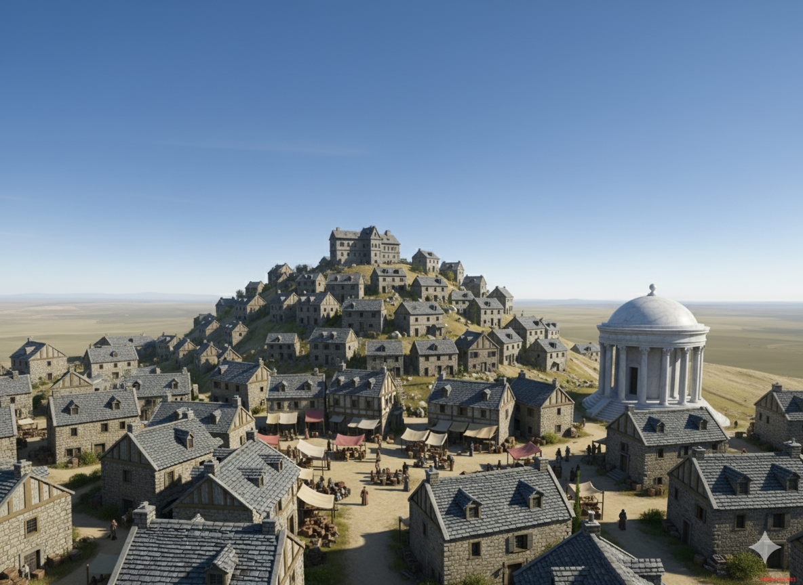
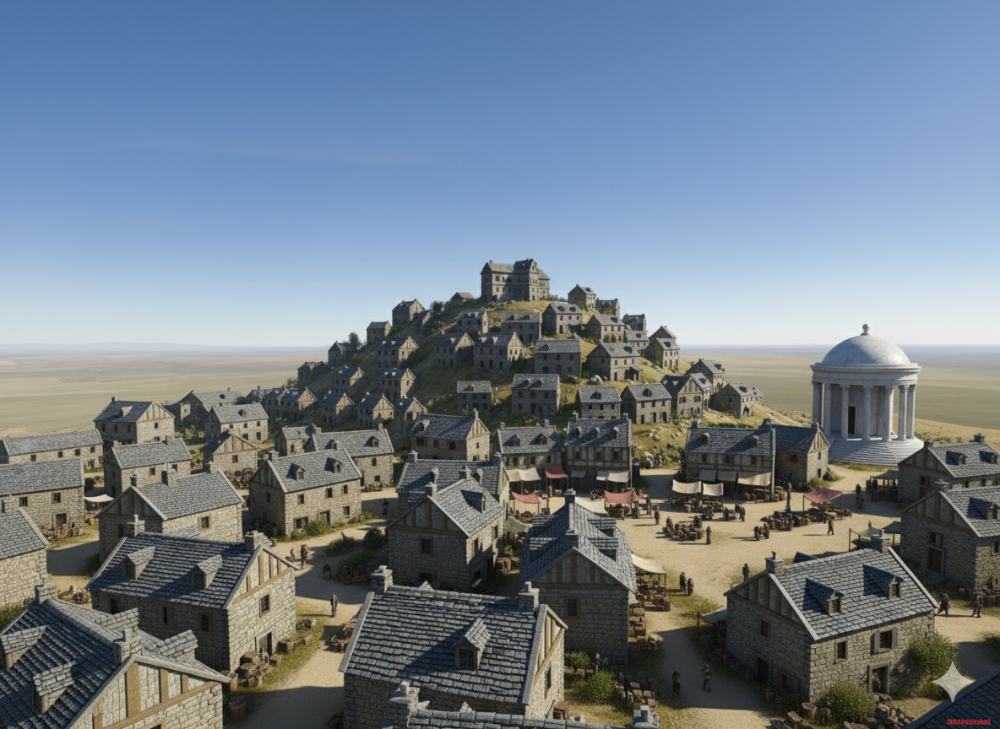
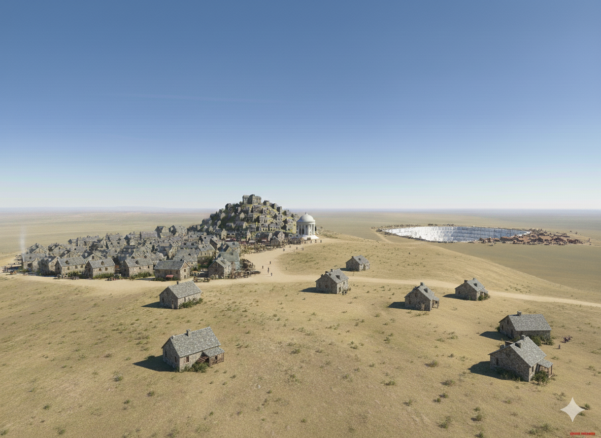

# Rochevent

Petit village du [royaume de Khazal](../royaumes/khazal.md) accroché aux pentes d'une colline qui surplombe le plateau d'Onalpita, **Rochevent** vit au rythme de sa carrière de marbre blanc, réputée dans tout Ziven. Situé à une quarantaine de kilomètres des **Collines de l'Écho**, le village est dominé par le **manoir d'Outremont**, résidence ancestrale de Lord Edgar de Valmont.

## Géographie et situation

Le village s'étage sur la colline, dominé par le manoir d'Outremont, offrant un **panorama** sur l'immensité du [plateau d'Onalpita](../regions/onalpita.md), balayé par les vents ; au nord, on voit les collines de l'écho. La carrière est à une quinzaine de minutes de marche, voisine d'un camp de bagnards. Le **climat** est sec, car les collines bloquent totalement l'influence océanique. Le village est exposé aux quatre vents, mais le plus rude est le vent du sud qui apporte le froid.

## Population
Les Rocheventaux sont principalement des contremaîtres et des gardes. Quelques bucherons exploitent la forêt au pied des [collines de l'écho](../lieux/colline-echo.md). Hormis eux et quelques marchands, l'ensemble des habitants dépend de l'exploitation de la carrière de Marbre blanc.

## Ressources et activités

La **carrière de marbre blanc**, exploitée depuis deux siècles, fournit une pierre renommée dans tout Ziven, utilisée pour palais, temples et mausolées ; l'exportation se fait via [Khareb](khareb.md). Un **camp de bagnards** attenant à la carrière constitue la source de main-d'œuvre forcée et alimente des rumeurs persistantes. L'**agriculture** est limitée à des jardins pierreux, pauvres en rendements, et le commerce compense ce manque.

## Lieux notables

Le **[Manoir d'Outremont](../lieux/manoir-outremont.md)** est la résidence seigneuriale de Lord Edgar de Valmont, symbole de la puissance locale. La **bibliothèque**, petite mais bien fournie, est tenue par un frère érudit qui veille sur une collection d'ouvrages anciens. Le **Temple d'Ulaa** est construit entièrement en marbre blanc, orné de colonnes richement décorées. L'**auberge** sert de halte pour voyageurs et marchands, et de centre de rumeurs locales ; quelques pèlerins y séjournent quand ils viennent voir l'impressionnant temple. La **place centrale** compte quelques échoppes vendant des produits alimentaires (pain, légumes secs, fromages, viandes salées), et il y a de temps à autre un colporteur. La **forge** est principalement dédiée au matériel d'extraction du marbre, mais peut réparer des armes ordinaires.

## Ambiance
Rochevent est un village austère et venteux, mais fier de son marbre : « la pierre de Rochevent » est recherchée dans toutes les grandes cités de Ziven.
Bien que Lord Edgar de Valmont y soit considéré comme un personnage influent, son prestige ne dépasse guère les frontières du royaume, ce qui reste pour lui un sujet d'amertume.

  
  
  

