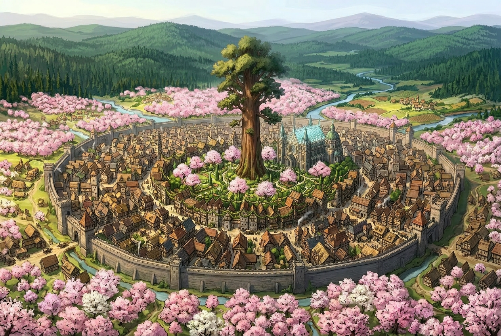
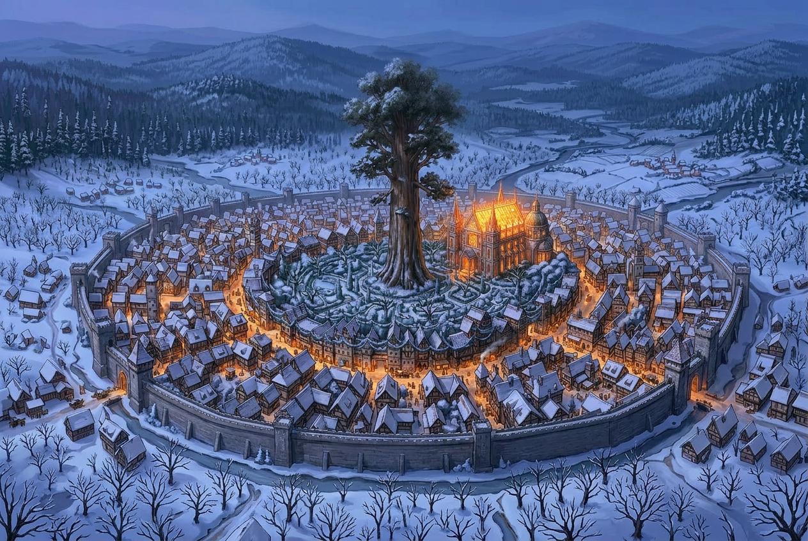
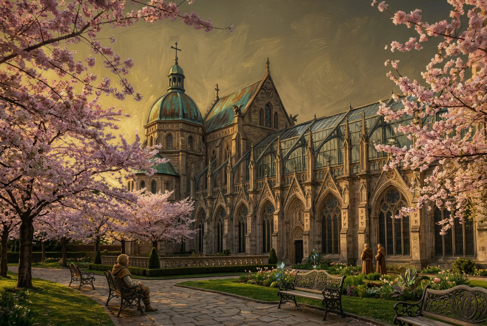

# Skjorren

**Type** : Capitale du royaume de [Tharvell](../royaumes/tharvell.md).  
**Particularité** : Ville construite autour d'un parc sacré abritant **Idingrodia**, l'Igrodia millénaire.

---

## Description générale

Skjorren est une ville dense et animée, dont toute l'architecture s'organise autour du parc d'Idingrodia. Les rues
rayonnent depuis ce centre verdoyant, et aucune construction ne peut empiéter sur la zone protégée autour des racines de
l'arbre sacré. La présence druidique est visible partout. On la voit autant dans l'architecture sobre du Collège que
dans les symboles gravés sur les portes des relais ou dans les guirlandes de feuilles tressées qui ornent les façades.

À l'extérieur des murailles, les **vergers de cerisiers** s'étendent sur plusieurs kilomètres carrés. Ces vergers sont
entretenus par des jardiniers liés aux druides et constituent un espace à part entière de la vie spirituelle et sociale
de la ville.

---

## Idingrodia

- Igrodia millénaire planté, selon la tradition, par le druide **Osgin**.
- Âge estimé : **1500 ans** — un dixième seulement de sa durée de vie potentielle.
- Hauteur actuelle : près de **100 m**.
- Un vaste espace libre de toute construction protège ses racines sur tout son périmètre.
- Les druides le considèrent comme un être vivant à part entière, centre spirituel du royaume.
- Selon la légende, Osgin vivrait encore **au cœur de l'arbre**, veillant sur Tharvell.

---

## Le Collège druidique

Hôtel particulier avec un **toit de verre**, situé à proximité immédiate du parc d'Idingrodia. Il abrite en son centre
un arbre sacré du type **Hodir**. C'est un arbre qui pousse normalement dans la forêt de Morness au nord, dans un climat
presque tropical. Afin qu'il puisse fleurir et resister aux rudes hivers de Skjorren, les druides ont créé un réseau de
chaleur qui maintient la température dans la serre.

Le Collège est le siège de l'autorité druidique suprême du royaume :

- **La Grande Voix** : titre porté par le chef du conseil druidique, interlocuteur principal de la noblesse et voix
  officielle des druides dans les affaires du royaume.
- **Le conseil des onze druides** : instance délibérative qui tranche les questions relevant du droit druidique, de la
  gestion des forêts, et des affaires politiques majeures. Ses décisions s'imposent à la noblesse.

Le Collège dispose d'un **réseau de communication végétal** : les avis et mandats émis par le conseil se propagent à
travers le réseau des arbres du royaume, permettant une diffusion rapide des informations aux relais et aux communautés
forestières. Aucun relais n'est autorisé à enfreindre une injonction du Collège.

---

## La Fête du Printemps

Événement annuel majeur, la Fête du Printemps réunit à Skjorren des pèlerins, marchands et druides venus de **tout le
sous-continent**.

Elle se déroule en deux espaces distincts :

- **Le parc d'Idingrodia**, en ville, où les druides célèbrent des cérémonies de symbiose avec l'arbre sacré.
- **Les vergers de cerisiers**, à l'extérieur des murailles, dont la floraison constitue le cœur symbolique de la fête.

La floraison des cerisiers est attendue comme un signe de renouveau et d'abondance. Des marchés extraordinaires
s'installent pour l'occasion : broderies, parfums, bijoux et denrées rares venus de tout Ziven. La fête dure plusieurs
jours et représente l'une des périodes commerciales les plus importantes du royaume.

---

## Lieux notables

### L'Hôtellerie des Grands Cerisiers

Auberge réputée de Skjorren, tenue par **Borwick**, un aubergiste pragmatique habitué à une clientèle fortunée. Sa
proximité avec les vergers en fait une adresse prisée lors de la Fête du Printemps.

---

## Rôle dans le royaume

Skjorren n'est pas seulement une capitale administrative — c'est avant tout un **centre spirituel**. La coexistence
d'Idingrodia, du Collège druidique et des vergers sacrés en fait un lieu unique sur le sous-continent, où l'autorité
politique et l'autorité religieuse sont indissociables.

  

  

  

