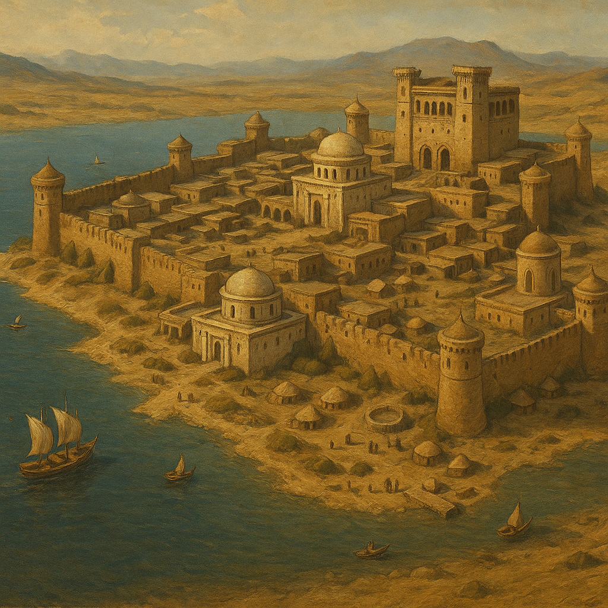

# Zerak'tul, Cité du Lac Dorin

Capitale politique de [Khazal](../royaumes/khazal.md), la ville est construite sur les bords du [lac Dorin](../lieux/lac_dorin.md). Centre du pouvoir royal, elle est aussi un **centre économique actif**, bien que moins dynamique que [Khareb](../villes/khareb.md). Sa garnison importante et la présence de la cour expliquent une population d'environ **15 000 habitants**. La pêche et l'agriculture locales apportent des revenus supplémentaires, soutenant la vie quotidienne.

## Fortifications

La ville est protégée par **une seule enceinte** de granit blond, massive et haute. La muraille s'enfonce légèrement dans l'eau pour protéger la rive. Des tours de guet sont espacées le long de l'enceinte, mais il n'y a pas de multiples remparts.

## Palais du Roi

Le palais est situé sur la hauteur de la ville. Son architecture est compacte et austère, dominée par des tours carrées. C'est la résidence du **roi de Khazal**, centre du pouvoir royal.

## Temples

### Temple du Soleil d'Azhara

Ce sanctuaire est dédié à **Azhara**, déesse solaire et de la justice. Construit en pierre blanche avec un dôme de cuivre étincelant, il est utilisé pour les **serments royaux, jugements et fêtes officielles**.

### Temple des Profondeurs

Ce sanctuaire est dédié à **Dorin**, esprit du lac. Semi-enterré, au bord immédiat de l'eau, il est orné de décorations en mosaïques bleutées. Un rituel d'offrandes jetées dans le lac permet d'apaiser ses créatures. Ce temple est très populaire auprès du peuple, parfois plus que le culte solaire.

## Régate du lac Dorin

Au mois de Trié, avec le retour de la Pukepacha, les pêcheurs de Zerak'Tul s'affrontent sur le [lac Dorin](../lieux/lac_dorin.md) lors d'une régate annuelle qui les oppose à ceux de [Néril](neril.md) et des villages lacustres. C'est une fête populaire simple, sans marchés extraordinaires ni pèlerinage, mais qui rythme la vie de la cité.
